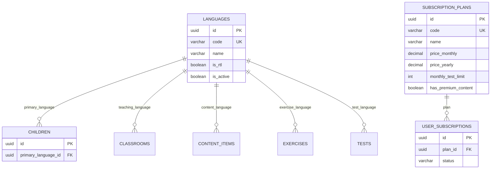

# 01. Core Reference Data

[← Back to Overview](./README.md) | [Next: User Management →](./02-user-management.md)

---

## 📋 Overview

Core reference data consists of **lookup tables** that store static or semi-static data used throughout the application. These tables are typically populated during deployment and rarely change.

### Tables in this Domain
- `languages` - Supported languages for content and UI
- `subscription_plans` - Available subscription tiers
- Additional lookup tables referenced in other domains

---

## 🗂️ Tables

### languages

Stores all supported languages for the platform. Used for content localization, UI translation, and child language preferences.

#### Schema

| Column | Type | Constraints | Description |
|--------|------|-------------|-------------|
| `id` | uuid | PRIMARY KEY | Unique identifier |
| `code` | varchar(10) | UNIQUE, NOT NULL | ISO 639-1 code (e.g., 'en', 'ar') |
| `name` | varchar(100) | NOT NULL | Language name (e.g., 'English', 'العربية') |
| `is_rtl` | boolean | DEFAULT false | Right-to-left language flag |
| `is_active` | boolean | DEFAULT true | Can be used in app |
| `created_at` | timestamp | DEFAULT now() | Record creation time |

#### Indexes
- `UNIQUE (code)` - Ensures no duplicate language codes
- `idx_languages_active` on `(is_active)` - Fast filtering of active languages

#### Example Data
```sql
INSERT INTO languages (id, code, name, is_rtl, is_active) VALUES
  (gen_random_uuid(), 'en', 'English', false, true),
  (gen_random_uuid(), 'ar', 'العربية', true, true),
  (gen_random_uuid(), 'fr', 'Français', false, true),
  (gen_random_uuid(), 'es', 'Español', false, true);
```

#### Usage Examples

**Get all active languages:**
```sql
SELECT id, code, name, is_rtl
FROM languages
WHERE is_active = true
ORDER BY name;
```

**Get language by code:**
```sql
SELECT * FROM languages WHERE code = 'ar';
```

---

### subscription_plans

Defines available subscription tiers with their features and pricing. Used for billing, feature gating, and usage limits.

#### Schema

| Column | Type | Constraints | Description |
|--------|------|-------------|-------------|
| `id` | uuid | PRIMARY KEY | Unique identifier |
| `code` | varchar(50) | UNIQUE, NOT NULL | Plan code (FREE, BASIC, PREMIUM) |
| `name` | varchar(100) | NOT NULL | Display name |
| `price_monthly` | decimal(10,2) | NOT NULL | Monthly price |
| `price_yearly` | decimal(10,2) | | Yearly price (discounted) |
| `currency` | varchar(3) | DEFAULT 'SAR' | Currency code (ISO 4217) |
| **Feature Limits** |
| `monthly_test_limit` | int | NULL = unlimited | Max tests per month |
| `max_children` | int | NULL = unlimited | Max children per account |
| `max_classrooms` | int | NULL = unlimited | Max classrooms for teachers |
| **Feature Flags** |
| `has_advanced_analytics` | boolean | DEFAULT false | Access to detailed analytics |
| `has_premium_content` | boolean | DEFAULT false | Access to premium content |
| `has_ai_recommendations` | boolean | DEFAULT false | AI-powered learning suggestions |
| `has_progress_reports` | boolean | DEFAULT false | Downloadable PDF reports |
| **Metadata** |
| `is_active` | boolean | DEFAULT true | Can be subscribed to |
| `created_at` | timestamp | DEFAULT now() | Record creation time |

#### Indexes
- `UNIQUE (code)` - Ensures no duplicate plan codes
- `idx_plans_active` on `(is_active)` - Fast filtering of available plans

#### Example Data
```sql
INSERT INTO subscription_plans (
  id, code, name, price_monthly, price_yearly, currency,
  monthly_test_limit, max_children, max_classrooms,
  has_advanced_analytics, has_premium_content, 
  has_ai_recommendations, has_progress_reports,
  is_active
) VALUES
  -- Free tier
  (
    gen_random_uuid(), 'FREE', 'Free Plan', 
    0.00, 0.00, 'SAR',
    2, 1, NULL,
    false, false, false, false,
    true
  ),
  -- Basic tier
  (
    gen_random_uuid(), 'BASIC', 'Basic Plan',
    49.00, 490.00, 'SAR',
    10, 3, 5,
    true, false, false, true,
    true
  ),
  -- Premium tier
  (
    gen_random_uuid(), 'PREMIUM', 'Premium Plan',
    99.00, 990.00, 'SAR',
    NULL, NULL, NULL,
    true, true, true, true,
    true
  );
```

#### Usage Examples

**Get all available plans:**
```sql
SELECT 
  code,
  name,
  price_monthly,
  price_yearly,
  monthly_test_limit,
  has_advanced_analytics,
  has_premium_content
FROM subscription_plans
WHERE is_active = true
ORDER BY price_monthly ASC;
```

**Check feature access:**
```sql
SELECT 
  sp.has_premium_content,
  sp.monthly_test_limit,
  us.tests_used_this_period
FROM user_subscriptions us
JOIN subscription_plans sp ON sp.id = us.plan_id
WHERE us.user_id = :user_id
  AND us.status = 'ACTIVE';
```

**Calculate yearly savings:**
```sql
SELECT 
  name,
  price_monthly,
  price_yearly,
  (price_monthly * 12) - price_yearly as yearly_savings,
  ROUND(((price_monthly * 12 - price_yearly) / (price_monthly * 12)) * 100, 1) as discount_percentage
FROM subscription_plans
WHERE price_yearly IS NOT NULL
  AND is_active = true;
```

---

## 🔗 Relationships



---

## 🎯 Business Rules

### Languages
1. **Code Format**: Must follow ISO 639-1 standard (2-letter codes)
2. **RTL Support**: Arabic, Hebrew, Persian must have `is_rtl = true`
3. **Deactivation**: Cannot deactivate if children/content exist in that language
4. **Default**: English (`en`) should always be active as fallback

### Subscription Plans
1. **Free Plan**: Must always exist with `code = 'FREE'`
2. **Pricing**: Yearly price should offer 10-20% discount over monthly
3. **Limits**: NULL means unlimited (premium feature)
4. **Deactivation**: Cannot deactivate if users are subscribed
5. **Feature Hierarchy**: Premium plans should include all lower-tier features

---

## ⚙️ Seed Data Script

```sql
-- Seed languages
INSERT INTO languages (code, name, is_rtl, is_active) VALUES
  ('en', 'English', false, true),
  ('ar', 'العربية', true, true),
  ('fr', 'Français', false, true),
  ('es', 'Español', false, false); -- Inactive, coming soon

-- Seed subscription plans
INSERT INTO subscription_plans (
  code, name, price_monthly, price_yearly, currency,
  monthly_test_limit, max_children, max_classrooms,
  has_advanced_analytics, has_premium_content, 
  has_ai_recommendations, has_progress_reports,
  is_active
) VALUES
  (
    'FREE', 'Free Plan', 
    0.00, 0.00, 'SAR',
    2, 1, NULL,
    false, false, false, false, true
  ),
  (
    'BASIC', 'Basic Plan',
    49.00, 490.00, 'SAR',
    10, 3, 5,
    true, false, false, true, true
  ),
  (
    'PREMIUM', 'Premium Plan',
    99.00, 990.00, 'SAR',
    NULL, NULL, NULL,
    true, true, true, true, true
  );
```

---

## 🔍 Common Queries

### Get user's plan features
```sql
SELECT 
  sp.*,
  us.status as subscription_status,
  us.current_period_end,
  us.tests_used_this_period,
  (sp.monthly_test_limit IS NULL OR 
   us.tests_used_this_period < sp.monthly_test_limit) as can_run_tests
FROM users u
LEFT JOIN user_subscriptions us ON us.user_id = u.id 
  AND us.status = 'ACTIVE'
LEFT JOIN subscription_plans sp ON sp.id = us.plan_id
WHERE u.id = :user_id;
```

### Get available content languages
```sql
SELECT DISTINCT l.*
FROM languages l
WHERE l.is_active = true
  AND EXISTS (
    SELECT 1 FROM content_items ci 
    WHERE ci.language_id = l.id 
      AND ci.status = 'APPROVED'
  )
ORDER BY l.name;
```

---

## 🚨 Migration Notes

### Adding a new language
```sql
-- 1. Insert language
INSERT INTO languages (code, name, is_rtl, is_active)
VALUES ('de', 'Deutsch', false, false); -- Start inactive

-- 2. After content is ready, activate
UPDATE languages SET is_active = true WHERE code = 'de';
```

### Updating subscription prices
```sql
-- Never update existing subscriptions' prices
-- Create new plan version or adjust future renewals only
UPDATE subscription_plans 
SET price_monthly = 59.00, price_yearly = 590.00
WHERE code = 'BASIC';
```

---

## 📊 Analytics Queries

### Most used language
```sql
SELECT 
  l.name,
  COUNT(DISTINCT c.id) as children_count,
  COUNT(DISTINCT ci.id) as content_items_count
FROM languages l
LEFT JOIN children c ON c.primary_language_id = l.id
LEFT JOIN content_items ci ON ci.language_id = l.id
WHERE l.is_active = true
GROUP BY l.id, l.name
ORDER BY children_count DESC;
```

### Subscription distribution
```sql
SELECT 
  sp.name,
  sp.price_monthly,
  COUNT(us.id) as active_subscriptions,
  SUM(us.tests_used_this_period) as total_tests_used
FROM subscription_plans sp
LEFT JOIN user_subscriptions us ON us.plan_id = sp.id 
  AND us.status = 'ACTIVE'
WHERE sp.is_active = true
GROUP BY sp.id, sp.name, sp.price_monthly
ORDER BY sp.price_monthly ASC;
```

---

## ✅ Best Practices

1. **Cache lookup data** - These tables change rarely, cache in application memory
2. **Use plan codes** - Reference plans by code, not ID, in application logic
3. **Soft deletes only** - Never hard delete languages or plans (set `is_active = false`)
4. **Audit changes** - Log all changes to subscription plans (pricing changes impact revenue)
5. **Version plans** - When changing features, consider creating new plan codes

---

[← Back to Overview](./README.md) | [Next: User Management →](./02-user-management.md)
