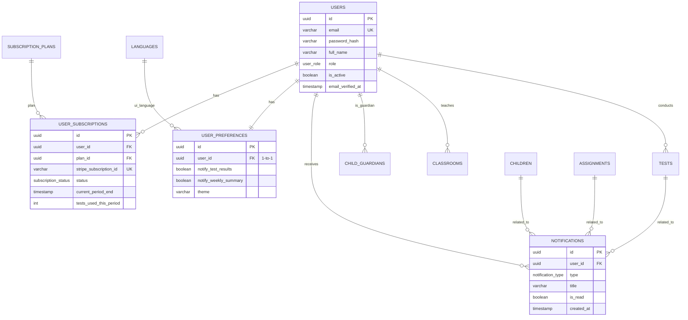

# 02. User Management

[← Previous: Core Reference Data](./01-core-reference-data.md) | [Back to Overview](./README.md) | [Next: Children & Guardians →](./03-children-guardians.md)

---

## 📋 Overview

User management handles authentication, authorization, subscriptions, preferences, and notifications for all users in the system.

### Tables in this Domain
- `users` - User accounts and authentication
- `user_subscriptions` - Billing and plan management
- `user_preferences` - Personalization settings
- `notifications` - In-app notifications and alerts

### User Roles
- **PARENT** - Manages their own children, views test results
- **TEACHER** - Creates classrooms, assigns work, manages multiple children
- **ADMIN** - Platform administration, content approval

---

## 🗂️ Tables

### users

Core user account table. Stores authentication credentials, profile information, and role-based access.

#### Schema

| Column | Type | Constraints | Description |
|--------|------|-------------|-------------|
| `id` | uuid | PRIMARY KEY | Unique identifier |
| `email` | varchar(255) | UNIQUE, NOT NULL | Login email address |
| `password_hash` | varchar(255) | NOT NULL | bcrypt/argon2 hashed password |
| `full_name` | varchar(200) | NOT NULL | User's display name |
| `role` | user_role | NOT NULL | PARENT, TEACHER, or ADMIN |
| **Profile** |
| `avatar_url` | varchar(500) | | Profile picture URL |
| `phone` | varchar(20) | | Contact phone number |
| `national_id` | varchar(20) | | For teacher verification |
| **Status** |
| `email_verified_at` | timestamp | | Email confirmation timestamp |
| `is_active` | boolean | DEFAULT true | Account enabled/disabled |
| `last_login_at` | timestamp | | Last successful login |
| **Billing** |
| `stripe_customer_id` | varchar(100) | | Stripe customer reference |
| **Audit** |
| `created_at` | timestamp | DEFAULT now() | Account creation |
| `updated_at` | timestamp | DEFAULT now() | Last modification |

#### Indexes
```sql
CREATE INDEX idx_users_email ON users(email);
CREATE INDEX idx_users_role ON users(role);
CREATE INDEX idx_users_active_role ON users(is_active, role);
```

#### Example Data
```sql
INSERT INTO users (
  id, email, password_hash, full_name, role, 
  email_verified_at, is_active
) VALUES
  (
    gen_random_uuid(),
    'parent@example.com',
    '$2b$12$...',  -- bcrypt hash
    'Sarah Johnson',
    'PARENT',
    now(),
    true
  ),
  (
    gen_random_uuid(),
    'teacher@school.edu',
    '$2b$12$...',
    'Mr. Ahmed Ali',
    'TEACHER',
    now(),
    true
  );
```

---

### user_subscriptions

Manages billing subscriptions, plan changes, and usage tracking integrated with Stripe.

#### Schema

| Column | Type | Constraints | Description |
|--------|------|-------------|-------------|
| `id` | uuid | PRIMARY KEY | Unique identifier |
| `user_id` | uuid | NOT NULL, FK | References users.id |
| `plan_id` | uuid | NOT NULL, FK | References subscription_plans.id |
| **Stripe Integration** |
| `stripe_subscription_id` | varchar(100) | UNIQUE | Stripe subscription ID |
| `stripe_price_id` | varchar(100) | | Stripe price ID |
| **Status** |
| `status` | subscription_status | NOT NULL | ACTIVE, TRIALING, PAST_DUE, etc. |
| **Dates** |
| `started_at` | timestamp | NOT NULL | Subscription start |
| `current_period_start` | timestamp | NOT NULL | Current billing period start |
| `current_period_end` | timestamp | NOT NULL | Current billing period end |
| `cancelled_at` | timestamp | | User cancelled (still active until period end) |
| `ended_at` | timestamp | | Subscription actually ended |
| **Usage Tracking** |
| `tests_used_this_period` | int | DEFAULT 0 | Tests run in current billing period |
| **Audit** |
| `created_at` | timestamp | DEFAULT now() | Subscription created |
| `updated_at` | timestamp | DEFAULT now() | Last modified |

#### Indexes
```sql
CREATE INDEX idx_subscriptions_user ON user_subscriptions(user_id);
CREATE INDEX idx_subscriptions_status ON user_subscriptions(status);
CREATE INDEX idx_subscriptions_user_active ON user_subscriptions(user_id, status);
```

#### Business Logic
```sql
-- Auto-increment test usage
CREATE OR REPLACE FUNCTION increment_test_usage()
RETURNS TRIGGER AS $$
BEGIN
  UPDATE user_subscriptions
  SET tests_used_this_period = tests_used_this_period + 1
  WHERE user_id = (
    SELECT conducted_by_id FROM tests WHERE id = NEW.id
  )
  AND status = 'ACTIVE';
  RETURN NEW;
END;
$$ LANGUAGE plpgsql;

CREATE TRIGGER after_test_insert
AFTER INSERT ON tests
FOR EACH ROW
EXECUTE FUNCTION increment_test_usage();
```

---

### user_preferences

User-specific settings for notifications and UI customization.

#### Schema

| Column | Type | Constraints | Description |
|--------|------|-------------|-------------|
| `id` | uuid | PRIMARY KEY | Unique identifier |
| `user_id` | uuid | UNIQUE, NOT NULL, FK | One-to-one with users |
| **Notification Preferences** |
| `notify_test_results` | boolean | DEFAULT true | Test completion alerts |
| `notify_weekly_summary` | boolean | DEFAULT true | Weekly progress emails |
| `notify_assignments` | boolean | DEFAULT true | New assignment alerts |
| `notify_inactivity_alerts` | boolean | DEFAULT true | Nudge to stay active |
| `notify_child_claims` | boolean | DEFAULT true | Claim request notifications |
| **UI Preferences** |
| `preferred_language_id` | uuid | FK | UI language (references languages.id) |
| `theme` | varchar(20) | DEFAULT 'LIGHT' | LIGHT, DARK, AUTO |
| **Audit** |
| `created_at` | timestamp | DEFAULT now() | Created with user account |
| `updated_at` | timestamp | DEFAULT now() | Last preference change |

#### Default Creation
```sql
-- Auto-create preferences when user is created
CREATE OR REPLACE FUNCTION create_user_preferences()
RETURNS TRIGGER AS $$
BEGIN
  INSERT INTO user_preferences (user_id, preferred_language_id)
  VALUES (NEW.id, (SELECT id FROM languages WHERE code = 'en' LIMIT 1));
  RETURN NEW;
END;
$$ LANGUAGE plpgsql;

CREATE TRIGGER after_user_insert
AFTER INSERT ON users
FOR EACH ROW
EXECUTE FUNCTION create_user_preferences();
```

---

### notifications

In-app notification system for alerts, reminders, and updates.

#### Schema

| Column | Type | Constraints | Description |
|--------|------|-------------|-------------|
| `id` | uuid | PRIMARY KEY | Unique identifier |
| `user_id` | uuid | NOT NULL, FK | Recipient user |
| `notification_type` | notification_type | NOT NULL | Category of notification |
| `title` | varchar(200) | NOT NULL | Notification headline |
| `message` | text | | Detailed message body |
| `action_url` | varchar(500) | | Deep link to relevant page |
| **Related Entities** |
| `related_child_id` | uuid | FK | Associated child (optional) |
| `related_test_id` | uuid | FK | Associated test (optional) |
| `related_assignment_id` | uuid | FK | Associated assignment (optional) |
| **Status** |
| `is_read` | boolean | DEFAULT false | User has viewed |
| `read_at` | timestamp | | When user marked as read |
| **Audit** |
| `created_at` | timestamp | DEFAULT now() | Notification sent time |

#### Indexes
```sql
CREATE INDEX idx_notifications_user_unread ON notifications(user_id, is_read);
CREATE INDEX idx_notifications_created ON notifications(created_at DESC);
```

#### Notification Types
```sql
-- Enum values
CREATE TYPE notification_type AS ENUM (
  'TEST_COMPLETED',           -- Child finished test
  'TEST_RESULTS_READY',       -- Results analyzed and available
  'ASSIGNMENT_CREATED',       -- Teacher created new assignment
  'ASSIGNMENT_DUE_SOON',      -- Assignment due in 24-48h
  'ASSIGNMENT_COMPLETED',     -- Child submitted assignment
  'ENROLLMENT_NEW',           -- Child enrolled in classroom
  'CLAIM_REQUEST_NEW',        -- Parent wants to claim child
  'CLAIM_REQUEST_APPROVED',   -- Teacher approved claim
  'CLAIM_REQUEST_REJECTED',   -- Teacher rejected claim
  'WEEKLY_SUMMARY',           -- Weekly progress report
  'MILESTONE_ACHIEVED',       -- Gamification achievement
  'INACTIVITY_REMINDER'       -- Haven't logged in for 7 days
);
```

---

## 🔗 Relationships



---

## 🎯 Business Rules

### User Account
1. **Email Uniqueness**: Emails must be unique across the system
2. **Email Verification**: Users should verify email before full access
3. **Password Security**: Minimum 8 characters, bcrypt hash with cost factor 12
4. **Account Deactivation**: Set `is_active = false` instead of deleting
5. **Role Assignment**: Cannot change role after account creation (create new account)

### Subscriptions
1. **One Active Subscription**: Users can only have one ACTIVE subscription at a time
2. **Free Plan Default**: New users start on FREE plan
3. **Graceful Degradation**: PAST_DUE status allows 7-day grace period
4. **Usage Limits**: Check `tests_used_this_period` before allowing new tests
5. **Period Reset**: Reset usage counters at `current_period_start`

### Notifications
1. **Respect Preferences**: Check user_preferences before sending
2. **Auto-Read After 30 Days**: Archive old unread notifications
3. **Related Entities**: Always link to child/test/assignment when applicable
4. **Batch Processing**: Group similar notifications (e.g., multiple assignments)

---

## 🔍 Common Queries

### Check if user can run a test
```sql
WITH active_subscription AS (
  SELECT 
    sp.monthly_test_limit,
    us.tests_used_this_period,
    us.current_period_end
  FROM user_subscriptions us
  JOIN subscription_plans sp ON sp.id = us.plan_id
  WHERE us.user_id = :user_id
    AND us.status = 'ACTIVE'
  LIMIT 1
)
SELECT 
  CASE 
    WHEN monthly_test_limit IS NULL THEN true  -- Unlimited
    WHEN tests_used_this_period < monthly_test_limit THEN true
    ELSE false
  END as can_run_test,
  monthly_test_limit,
  tests_used_this_period,
  monthly_test_limit - tests_used_this_period as tests_remaining,
  current_period_end as resets_at
FROM active_subscription;
```

### Get unread notification count
```sql
SELECT 
  notification_type,
  COUNT(*) as unread_count
FROM notifications
WHERE user_id = :user_id
  AND is_read = false
GROUP BY notification_type
ORDER BY unread_count DESC;
```

### Get user's complete profile
```sql
SELECT 
  u.*,
  up.theme,
  up.notify_test_results,
  up.notify_weekly_summary,
  l.code as preferred_language_code,
  sp.code as subscription_plan_code,
  sp.name as subscription_plan_name,
  us.status as subscription_status,
  us.current_period_end,
  sp.monthly_test_limit,
  us.tests_used_this_period,
  COUNT(DISTINCT cg.child_id) as children_count
FROM users u
LEFT JOIN user_preferences up ON up.user_id = u.id
LEFT JOIN languages l ON l.id = up.preferred_language_id
LEFT JOIN user_subscriptions us ON us.user_id = u.id AND us.status = 'ACTIVE'
LEFT JOIN subscription_plans sp ON sp.id = us.plan_id
LEFT JOIN child_guardians cg ON cg.guardian_id = u.id
WHERE u.id = :user_id
GROUP BY u.id, up.id, l.code, sp.code, sp.name, us.status, us.current_period_end, 
         sp.monthly_test_limit, us.tests_used_this_period;
```

---

## 🚀 API Integration Examples

### Stripe Webhook Handler
```python
@app.post("/webhooks/stripe")
async def stripe_webhook(request: Request):
    event = stripe.Webhook.construct_event(
        payload=await request.body(),
        sig_header=request.headers.get("stripe-signature"),
        secret=STRIPE_WEBHOOK_SECRET
    )
    
    if event.type == "customer.subscription.updated":
        subscription = event.data.object
        
        # Update database
        await db.execute("""
            UPDATE user_subscriptions
            SET 
                status = :status,
                current_period_start = :period_start,
                current_period_end = :period_end,
                updated_at = now()
            WHERE stripe_subscription_id = :subscription_id
        """, {
            "status": subscription.status,
            "period_start": subscription.current_period_start,
            "period_end": subscription.current_period_end,
            "subscription_id": subscription.id
        })
        
    return {"received": True}
```

### Send Notification
```python
async def send_notification(
    user_id: uuid.UUID,
    notification_type: str,
    title: str,
    message: str = None,
    action_url: str = None,
    related_child_id: uuid.UUID = None
):
    # Check user preferences
    prefs = await db.fetchone("""
        SELECT notify_test_results, notify_assignments, notify_weekly_summary
        FROM user_preferences
        WHERE user_id = :user_id
    """, {"user_id": user_id})
    
    # Map notification type to preference
    pref_map = {
        "TEST_COMPLETED": prefs["notify_test_results"],
        "ASSIGNMENT_CREATED": prefs["notify_assignments"],
        "WEEKLY_SUMMARY": prefs["notify_weekly_summary"]
    }
    
    if not pref_map.get(notification_type, True):
        return  # User opted out
    
    # Insert notification
    await db.execute("""
        INSERT INTO notifications (
            user_id, notification_type, title, message, 
            action_url, related_child_id
        ) VALUES (
            :user_id, :type, :title, :message, 
            :action_url, :related_child_id
        )
    """, {
        "user_id": user_id,
        "type": notification_type,
        "title": title,
        "message": message,
        "action_url": action_url,
        "related_child_id": related_child_id
    })
    
    # Send push notification, email, etc.
    await push_service.send(user_id, title, message)
```

---

## ✅ Best Practices

1. **Password Hashing**: Use bcrypt with cost factor 12 minimum
2. **Session Management**: Store sessions in Redis, not in this database
3. **Email Verification**: Require verification for critical actions (running tests)
4. **Subscription Caching**: Cache active subscription in application memory
5. **Notification Batching**: Group notifications sent within 1 hour
6. **Soft Deletes**: Never hard delete users (GDPR: anonymize instead)

---

[← Previous: Core Reference Data](./01-core-reference-data.md) | [Back to Overview](./README.md) | [Next: Children & Guardians →](./03-children-guardians.md)
