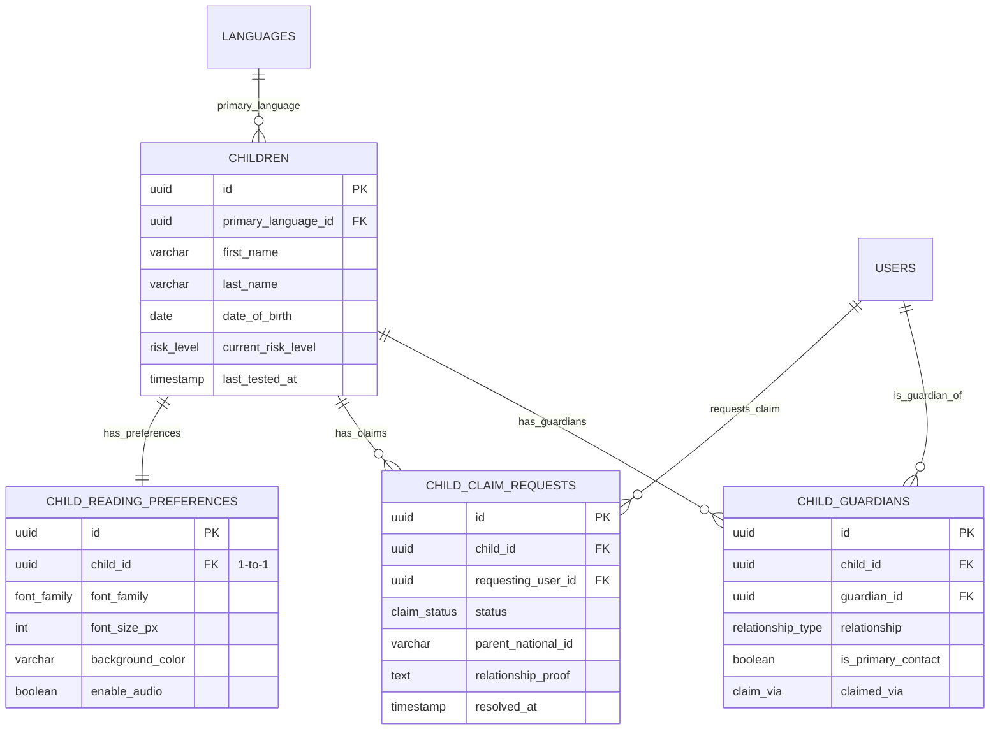

# 03. Children & Guardians

[← Previous: User Management](./02-user-management.md) | [Back to Overview](./README.md) | [Next: Testing & Assessment →](./04-testing-assessment.md)

---

## 📋 Overview

This domain manages child profiles, guardian relationships, claim requests, and reading preferences. It supports the complex scenario where one child can have multiple guardians (parents and teachers).

### Tables in this Domain
- `children` - Child profiles and educational data
- `child_guardians` - Many-to-many relationship between children and users
- `child_claim_requests` - Parent requests to claim teacher-created children
- `child_reading_preferences` - Personalized reading settings per child

### Key Concepts
- **Primary Guardian**: The main contact person (usually parent who created the account)
- **Claim Process**: Parents can request access to children created by teachers
- **Multi-Guardian**: One child can have both parents and teachers as guardians

---

## 🗂️ Tables

### children

Core child profile with educational information and dyslexia risk tracking.

#### Schema

| Column | Type | Constraints | Description |
|--------|------|-------------|-------------|
| `id` | uuid | PRIMARY KEY | Unique identifier |
| `primary_language_id` | uuid | NOT NULL, FK | Main language for content |
| **Basic Info** |
| `first_name` | varchar(100) | NOT NULL | Child's first name |
| `last_name` | varchar(100) | NOT NULL | Child's last name |
| `date_of_birth` | date | NOT NULL | For age calculation |
| `gender` | varchar(20) | | MALE, FEMALE, OTHER |
| **Educational Info** |
| `grade_level` | int | | 1-12 |
| `student_id` | varchar(50) | | School student ID |
| **Risk Assessment** |
| `current_risk_level` | risk_level | | From latest test (LOW, MEDIUM, HIGH) |
| `last_tested_at` | timestamp | | Most recent test date |
| **Status** |
| `is_active` | boolean | DEFAULT true | Account enabled |
| **Audit** |
| `created_at` | timestamp | DEFAULT now() | Profile created |
| `updated_at` | timestamp | DEFAULT now() | Last modified |

#### Indexes
```sql
CREATE INDEX idx_children_language ON children(primary_language_id);
CREATE INDEX idx_children_risk ON children(current_risk_level);
CREATE INDEX idx_children_active ON children(is_active);
CREATE INDEX idx_children_last_tested ON children(last_tested_at DESC);
```

#### Computed Fields
```sql
-- Calculate age from date_of_birth
CREATE OR REPLACE FUNCTION calculate_age(birth_date date) 
RETURNS int AS $$
BEGIN
  RETURN EXTRACT(YEAR FROM AGE(birth_date));
END;
$$ LANGUAGE plpgsql IMMUTABLE;

-- Use in queries
SELECT 
  id,
  first_name,
  last_name,
  calculate_age(date_of_birth) as age,
  current_risk_level
FROM children;
```

---

### child_guardians

Junction table managing the many-to-many relationship between children and guardians (users).

#### Schema

| Column | Type | Constraints | Description |
|--------|------|-------------|-------------|
| `id` | uuid | PRIMARY KEY | Unique identifier |
| `child_id` | uuid | NOT NULL, FK | References children.id |
| `guardian_id` | uuid | NOT NULL, FK | References users.id |
| `relationship` | relationship_type | NOT NULL | PARENT, GUARDIAN, TEACHER, OTHER |
| `is_primary_contact` | boolean | DEFAULT false | Main contact person |
| **Claim Tracking** |
| `claimed_at` | timestamp | NOT NULL, DEFAULT now() | When relationship established |
| `claimed_via` | claim_via | | CREATED, CLAIMED, TEACHER_ASSIGNED |
| **Permissions** |
| `can_view_tests` | boolean | DEFAULT true | Can see test results |
| `can_manage_profile` | boolean | DEFAULT true | Can edit child info |
| **Audit** |
| `created_at` | timestamp | DEFAULT now() | Relationship created |

#### Indexes
```sql
CREATE UNIQUE INDEX idx_guardians_child_user 
  ON child_guardians(child_id, guardian_id);
CREATE INDEX idx_guardians_user ON child_guardians(guardian_id);
CREATE INDEX idx_guardians_primary 
  ON child_guardians(child_id, is_primary_contact);
```

#### Business Rules
```sql
-- Only one primary contact per child
CREATE UNIQUE INDEX idx_guardians_one_primary 
  ON child_guardians(child_id) 
  WHERE is_primary_contact = true;

-- Auto-set first guardian as primary
CREATE OR REPLACE FUNCTION set_first_guardian_primary()
RETURNS TRIGGER AS $$
BEGIN
  IF NOT EXISTS (
    SELECT 1 FROM child_guardians 
    WHERE child_id = NEW.child_id 
      AND id != NEW.id
  ) THEN
    NEW.is_primary_contact = true;
  END IF;
  RETURN NEW;
END;
$$ LANGUAGE plpgsql;

CREATE TRIGGER before_guardian_insert
BEFORE INSERT ON child_guardians
FOR EACH ROW
EXECUTE FUNCTION set_first_guardian_primary();
```

---

### child_claim_requests

Handles parent requests to claim children that were created by teachers.

#### Schema

| Column | Type | Constraints | Description |
|--------|------|-------------|-------------|
| `id` | uuid | PRIMARY KEY | Unique identifier |
| `child_id` | uuid | NOT NULL, FK | Child being claimed |
| `requesting_user_id` | uuid | NOT NULL, FK | Parent making request |
| **Request Details** |
| `relationship` | relationship_type | NOT NULL | PARENT, GUARDIAN, OTHER |
| `parent_national_id` | varchar(20) | | For teacher verification |
| `parent_phone` | varchar(20) | | For teacher contact |
| `relationship_proof` | text | | Explanation from parent |
| **Resolution** |
| `status` | claim_status | NOT NULL, DEFAULT 'PENDING' | PENDING, APPROVED, REJECTED, CANCELLED |
| `resolved_by_id` | uuid | FK | Teacher who resolved |
| `resolved_at` | timestamp | | Resolution timestamp |
| `rejection_reason` | text | | Teacher's explanation if rejected |
| **Audit** |
| `created_at` | timestamp | DEFAULT now() | Request submitted |

#### Indexes
```sql
CREATE UNIQUE INDEX idx_claims_unique_pending 
  ON child_claim_requests(child_id, requesting_user_id, status)
  WHERE status = 'PENDING';
CREATE INDEX idx_claims_status ON child_claim_requests(status);
CREATE INDEX idx_claims_child ON child_claim_requests(child_id);
```

#### Workflow
```sql
-- 1. Parent submits claim request
INSERT INTO child_claim_requests (
  child_id, requesting_user_id, relationship, 
  parent_national_id, relationship_proof
) VALUES (
  :child_id, :parent_id, 'PARENT',
  '1234567890', 'I am the biological mother of this child'
);

-- 2. Notify teacher
INSERT INTO notifications (
  user_id, notification_type, title, message, related_child_id
) 
SELECT 
  c.teacher_id,
  'CLAIM_REQUEST_NEW',
  'New Claim Request',
  :parent_name || ' wants to claim ' || ch.first_name,
  :child_id
FROM classrooms c
JOIN classroom_enrollments ce ON ce.classroom_id = c.id
JOIN children ch ON ch.id = ce.child_id
WHERE ce.child_id = :child_id;

-- 3. Teacher approves
UPDATE child_claim_requests
SET 
  status = 'APPROVED',
  resolved_by_id = :teacher_id,
  resolved_at = now()
WHERE id = :request_id;

-- 4. Create guardian relationship
INSERT INTO child_guardians (
  child_id, guardian_id, relationship, claimed_via
)
SELECT 
  child_id, requesting_user_id, relationship, 'CLAIMED'
FROM child_claim_requests
WHERE id = :request_id;

-- 5. Notify parent
INSERT INTO notifications (
  user_id, notification_type, title, message
) VALUES (
  :parent_id,
  'CLAIM_REQUEST_APPROVED',
  'Claim Approved',
  'Your request to claim ' || :child_name || ' has been approved'
);
```

---

### child_reading_preferences

Personalized reading settings that adapt the reading interface for each child.

#### Schema

| Column | Type | Constraints | Description |
|--------|------|-------------|-------------|
| `id` | uuid | PRIMARY KEY | Unique identifier |
| `child_id` | uuid | UNIQUE, NOT NULL, FK | One-to-one with children |
| **Text Appearance** |
| `font_family` | font_family | DEFAULT 'ARIAL' | Font choice |
| `font_size_px` | int | DEFAULT 18 | 12-32 px range |
| `line_height_em` | float | DEFAULT 1.5 | 1.0-2.5 em range |
| `letter_spacing_em` | float | DEFAULT 0 | -0.1 to 0.5 em |
| `word_spacing_em` | float | DEFAULT 0 | 0 to 1.0 em |
| **Colors** |
| `background_color` | varchar(7) | DEFAULT '#FFFFFF' | Hex color |
| `text_color` | varchar(7) | DEFAULT '#000000' | Hex color |
| `highlight_color` | varchar(7) | DEFAULT '#FFFF00' | Hex color for tracking |
| **Audio** |
| `enable_audio` | boolean | DEFAULT true | Text-to-speech |
| `audio_speed` | float | DEFAULT 1.0 | 0.5-2.0 speed |
| `voice_gender` | varchar(20) | DEFAULT 'NEUTRAL' | MALE, FEMALE, NEUTRAL |
| **Audit** |
| `created_at` | timestamp | DEFAULT now() | Created with child |
| `updated_at` | timestamp | DEFAULT now() | Last preference change |

#### Auto-Create Trigger
```sql
CREATE OR REPLACE FUNCTION create_reading_preferences()
RETURNS TRIGGER AS $$
BEGIN
  INSERT INTO child_reading_preferences (child_id)
  VALUES (NEW.id);
  RETURN NEW;
END;
$$ LANGUAGE plpgsql;

CREATE TRIGGER after_child_insert
AFTER INSERT ON children
FOR EACH ROW
EXECUTE FUNCTION create_reading_preferences();
```

#### Dyslexia-Friendly Presets
```sql
-- Apply dyslexia-friendly settings
UPDATE child_reading_preferences
SET 
  font_family = 'OPEN_DYSLEXIC',
  font_size_px = 20,
  line_height_em = 1.8,
  letter_spacing_em = 0.12,
  word_spacing_em = 0.2,
  background_color = '#FFFBF0',  -- Warm off-white
  text_color = '#1A1A1A'         -- Soft black
WHERE child_id = :child_id;
```

---

## 🔗 Relationships



---

## 🎯 Business Rules

### Children
1. **Age Calculation**: Always calculate from `date_of_birth`, never store age
2. **Risk Level**: Auto-updated from latest test result
3. **Soft Delete**: Set `is_active = false`, never hard delete
4. **Name Display**: Always show as "FirstName LastName"

### Guardians
1. **One Primary**: Each child must have exactly one primary contact
2. **Multiple Teachers**: Child can be in multiple classrooms (multiple teacher guardians)
3. **Permission Inheritance**: Primary contact has all permissions by default
4. **Remove Last Guardian**: Cannot remove last guardian (child would be orphaned)

### Claim Requests
1. **One Pending**: Only one pending request per parent-child pair
2. **Auto-Expire**: PENDING requests expire after 30 days
3. **Teacher Only**: Only teachers can approve/reject claims
4. **Same Classroom**: Parent can only claim children in their teacher's classroom

### Reading Preferences
1. **Auto-Create**: Created automatically when child profile is created
2. **Accessibility First**: Default settings should be readable for all
3. **Color Contrast**: Validate WCAG 2.1 AA contrast ratios
4. **Font Availability**: Only allow fonts that are loaded in the app

---

## 🔍 Common Queries

### Get child with all guardians
```sql
SELECT 
  c.id,
  c.first_name,
  c.last_name,
  calculate_age(c.date_of_birth) as age,
  c.current_risk_level,
  c.last_tested_at,
  json_agg(
    json_build_object(
      'name', u.full_name,
      'email', u.email,
      'relationship', cg.relationship,
      'is_primary', cg.is_primary_contact,
      'can_view_tests', cg.can_view_tests
    )
  ) as guardians
FROM children c
JOIN child_guardians cg ON cg.child_id = c.id
JOIN users u ON u.id = cg.guardian_id
WHERE c.id = :child_id
GROUP BY c.id;
```

### Get all children visible to a user
```sql
-- Works for both parents and teachers
SELECT DISTINCT
  c.id,
  c.first_name,
  c.last_name,
  c.current_risk_level,
  calculate_age(c.date_of_birth) as age,
  cg.relationship,
  cg.is_primary_contact
FROM children c
JOIN child_guardians cg ON cg.child_id = c.id
WHERE cg.guardian_id = :user_id
  AND c.is_active = true
ORDER BY c.first_name, c.last_name;
```

### Get pending claim requests for teacher
```sql
SELECT 
  cr.id,
  cr.created_at,
  c.first_name || ' ' || c.last_name as child_name,
  c.id as child_id,
  u.full_name as parent_name,
  u.email as parent_email,
  cr.parent_national_id,
  cr.parent_phone,
  cr.relationship,
  cr.relationship_proof
FROM child_claim_requests cr
JOIN children c ON c.id = cr.child_id
JOIN users u ON u.id = cr.requesting_user_id
WHERE cr.status = 'PENDING'
  AND c.id IN (
    SELECT ce.child_id 
    FROM classroom_enrollments ce
    JOIN classrooms cl ON cl.id = ce.classroom_id
    WHERE cl.teacher_id = :teacher_id
  )
ORDER BY cr.created_at ASC;
```

### Get reading preferences with child info
```sql
SELECT 
  c.first_name,
  c.last_name,
  rp.*
FROM children c
JOIN child_reading_preferences rp ON rp.child_id = c.id
WHERE c.id = :child_id;
```

---

## 🚀 API Examples

### Create child with guardian (parent creates)
```python
@router.post("/children")
async def create_child(
    child_data: ChildCreate,
    current_user: User = Depends(get_current_user),
    db: Database = Depends(get_db)
):
    # Create child
    child_id = await db.execute("""
        INSERT INTO children (
            primary_language_id, first_name, last_name, 
            date_of_birth, gender, grade_level
        ) VALUES (:lang_id, :first, :last, :dob, :gender, :grade)
        RETURNING id
    """, {
        "lang_id": child_data.primary_language_id,
        "first": child_data.first_name,
        "last": child_data.last_name,
        "dob": child_data.date_of_birth,
        "gender": child_data.gender,
        "grade": child_data.grade_level
    })
    
    # Create guardian relationship
    await db.execute("""
        INSERT INTO child_guardians (
            child_id, guardian_id, relationship, 
            is_primary_contact, claimed_via
        ) VALUES (:child_id, :user_id, :relationship, true, 'CREATED')
    """, {
        "child_id": child_id,
        "user_id": current_user.id,
        "relationship": "PARENT"
    })
    
    # Reading preferences auto-created by trigger
    
    return {"id": child_id, "message": "Child created successfully"}
```

### Submit claim request
```python
@router.post("/children/{child_id}/claim")
async def claim_child(
    child_id: UUID,
    claim_data: ClaimRequest,
    current_user: User = Depends(get_current_user),
    db: Database = Depends(get_db)
):
    # Check if child exists and is in a classroom
    classroom = await db.fetchone("""
        SELECT cl.id, cl.teacher_id
        FROM classroom_enrollments ce
        JOIN classrooms cl ON cl.id = ce.classroom_id
        WHERE ce.child_id = :child_id
        LIMIT 1
    """, {"child_id": child_id})
    
    if not classroom:
        raise HTTPException(404, "Child not found or not in classroom")
    
    # Create claim request
    request_id = await db.execute("""
        INSERT INTO child_claim_requests (
            child_id, requesting_user_id, relationship,
            parent_national_id, parent_phone, relationship_proof
        ) VALUES (
            :child_id, :user_id, :relationship,
            :national_id, :phone, :proof
        )
        RETURNING id
    """, {
        "child_id": child_id,
        "user_id": current_user.id,
        "relationship": claim_data.relationship,
        "national_id": claim_data.national_id,
        "phone": claim_data.phone,
        "proof": claim_data.relationship_proof
    })
    
    # Notify teacher
    await send_notification(
        user_id=classroom["teacher_id"],
        notification_type="CLAIM_REQUEST_NEW",
        title="New Claim Request",
        message=f"{current_user.full_name} wants to claim a child",
        related_child_id=child_id
    )
    
    return {"id": request_id, "status": "PENDING"}
```

---

## ✅ Best Practices

1. **Always Check Permissions**: Verify guardian relationship before allowing access
2. **Privacy First**: Never expose children to users without guardian relationship
3. **Age Calculations**: Always compute age on-the-fly from date_of_birth
4. **Claim Verification**: Teachers should verify national ID before approving
5. **Reading Preferences**: Provide dyslexia-friendly presets as quick options

---

[← Previous: User Management](./02-user-management.md) | [Back to Overview](./README.md) | [Next: Testing & Assessment →](./04-testing-assessment.md)
