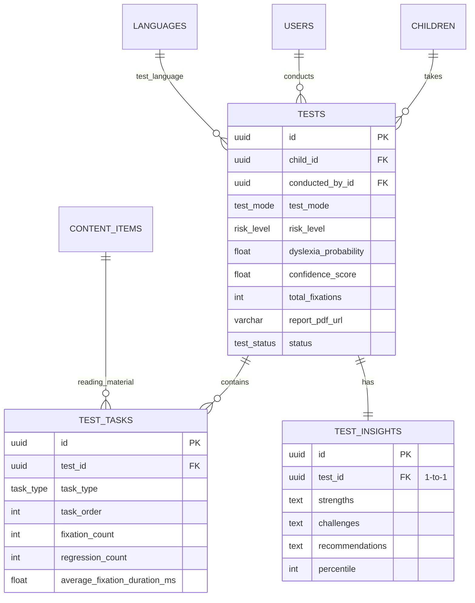

# 04. Testing & Assessment

[← Previous: Children & Guardians](./03-children-guardians.md) | [Back to Overview](./README.md) | [Next: Classroom Management →](./05-classroom-management.md)

---

## 📋 Overview

The testing domain is the **core feature** of Lexora. It manages dyslexia screening tests using eye-tracking or webcam-based gaze analysis, stores results, and generates AI-powered insights.

### Tables in this Domain
- `tests` - Main test records with risk assessment results
- `test_tasks` - Individual reading tasks within each test (3 tasks per test)
- `test_insights` - AI-generated recommendations and analysis

### Test Workflow
1. **Initiate Test**: User starts test session (Tobii or webcam mode)
2. **Complete 3 Tasks**: Child reads syllables, pseudo-words, and meaningful text
3. **Analyze Gaze Data**: ML service processes eye movements
4. **Generate Results**: Risk level, probability score, confidence
5. **Create Insights**: AI generates personalized recommendations
6. **Notify Guardians**: Parents/teachers receive test completion notification

---

## 🗂️ Tables

### tests

Main test record containing configuration, results, and data storage references.

#### Schema

| Column | Type | Constraints | Description |
|--------|------|-------------|-------------|
| `id` | uuid | PRIMARY KEY | Unique identifier |
| `child_id` | uuid | NOT NULL, FK | Child being tested |
| `conducted_by_id` | uuid | NOT NULL, FK | User who ran the test |
| **Test Configuration** |
| `test_mode` | test_mode | NOT NULL | TOBII_EYE_TRACKER or WEBCAM_GAZE |
| `language_id` | uuid | NOT NULL, FK | Language of reading material |
| **Results** |
| `risk_level` | risk_level | | LOW, MEDIUM, HIGH |
| `dyslexia_probability` | float | | 0.0-1.0 probability score |
| `confidence_score` | float | | 0.0-1.0 model confidence |
| **Task Metrics** |
| `total_fixations` | int | | Total eye fixations across all tasks |
| `total_duration_seconds` | int | | Total test duration |
| `average_fixation_ms` | float | | Mean fixation duration |
| **Data Storage** |
| `raw_gaze_data_url` | varchar(500) | | S3/storage URL for raw data |
| `processed_features_url` | varchar(500) | | URL for processed features |
| `report_pdf_url` | varchar(500) | | Generated PDF report |
| **Status** |
| `status` | test_status | DEFAULT 'COMPLETED' | IN_PROGRESS, COMPLETED, FAILED, CANCELLED |
| `notes` | text | | Tester's observations |
| **Audit** |
| `created_at` | timestamp | DEFAULT now() | Test completion time |

#### Indexes
```sql
CREATE INDEX idx_tests_child ON tests(child_id);
CREATE INDEX idx_tests_child_recent ON tests(child_id, created_at DESC);
CREATE INDEX idx_tests_risk ON tests(risk_level);
CREATE INDEX idx_tests_mode ON tests(test_mode);
CREATE INDEX idx_tests_status ON tests(status);
```

#### Auto-Update Child Risk Level
```sql
CREATE OR REPLACE FUNCTION update_child_risk_level()
RETURNS TRIGGER AS $$
BEGIN
  IF NEW.status = 'COMPLETED' AND NEW.risk_level IS NOT NULL THEN
    UPDATE children
    SET 
      current_risk_level = NEW.risk_level,
      last_tested_at = NEW.created_at
    WHERE id = NEW.child_id;
  END IF;
  RETURN NEW;
END;
$$ LANGUAGE plpgsql;

CREATE TRIGGER after_test_complete
AFTER INSERT OR UPDATE ON tests
FOR EACH ROW
WHEN (NEW.status = 'COMPLETED')
EXECUTE FUNCTION update_child_risk_level();
```

---

### test_tasks

Individual reading tasks within a test. Each test has exactly 3 tasks.

#### Schema

| Column | Type | Constraints | Description |
|--------|------|-------------|-------------|
| `id` | uuid | PRIMARY KEY | Unique identifier |
| `test_id` | uuid | NOT NULL, FK | Parent test |
| `task_type` | task_type | NOT NULL | SYLLABLES, PSEUDO_WORDS, MEANINGFUL_TEXT |
| `task_order` | int | NOT NULL | 1, 2, or 3 |
| `content_id` | uuid | FK | Reading material used (optional) |
| **Task Metrics** |
| `fixation_count` | int | | Number of fixations in this task |
| `duration_seconds` | int | | Task duration |
| `average_fixation_duration_ms` | float | | Mean fixation length |
| `regression_count` | int | | Backward eye movements (re-reading) |
| **Data Storage** |
| `gaze_points_url` | varchar(500) | | Task-specific gaze data |
| **Audit** |
| `completed_at` | timestamp | | Task completion time |

#### Indexes
```sql
CREATE INDEX idx_tasks_test ON test_tasks(test_id);
CREATE UNIQUE INDEX idx_tasks_test_order ON test_tasks(test_id, task_order);
```

#### Task Type Details

```sql
-- Task types and their purposes
CREATE TYPE task_type AS ENUM (
  'SYLLABLES',        -- Single syllables (ba, ta, ka)
  'PSEUDO_WORDS',     -- Nonsense words (blat, trup, snad)
  'MEANINGFUL_TEXT',  -- Real words and sentences
  'PARAGRAPH'         -- (Reserved for future use)
);
```

**Reading Patterns:**
- **Syllables**: Tests basic phonological processing
- **Pseudo-words**: Tests decoding ability without semantic help
- **Meaningful Text**: Tests reading comprehension and fluency

---

### test_insights

AI-generated analysis and recommendations based on test results.

#### Schema

| Column | Type | Constraints | Description |
|--------|------|-------------|-------------|
| `id` | uuid | PRIMARY KEY | Unique identifier |
| `test_id` | uuid | UNIQUE, NOT NULL, FK | One-to-one with tests |
| **AI-Generated Insights** |
| `strengths` | text | | Positive patterns observed |
| `challenges` | text | | Areas needing attention |
| `recommendations` | text | | Suggested interventions |
| **Comparison** |
| `percentile` | int | | Compared to age group (1-100) |
| `comparison_group` | varchar(100) | | 'Age 8-9' or 'Grade 3' |
| **Audit** |
| `generated_at` | timestamp | DEFAULT now() | When AI generated insights |

#### Auto-Generate Insights
```sql
CREATE OR REPLACE FUNCTION generate_test_insights()
RETURNS TRIGGER AS $$
BEGIN
  -- Call AI service to generate insights
  -- This would be done by application code in practice
  INSERT INTO test_insights (test_id, strengths, challenges, recommendations)
  VALUES (
    NEW.id,
    'Generated strengths...',
    'Generated challenges...',
    'Generated recommendations...'
  );
  RETURN NEW;
END;
$$ LANGUAGE plpgsql;

CREATE TRIGGER after_test_insert
AFTER INSERT ON tests
FOR EACH ROW
WHEN (NEW.status = 'COMPLETED')
EXECUTE FUNCTION generate_test_insights();
```

---

## 🔗 Relationships



---

## 🎯 Business Rules

### Tests
1. **Three Tasks Required**: Every test must have exactly 3 tasks
2. **Task Order**: Must be completed in sequence (1→2→3)
3. **Mode Selection**: Cannot change test_mode after test starts
4. **Storage Limits**: Raw gaze data retained for 90 days, then archived
5. **Retesting**: Minimum 30 days between tests for same child

### Test Tasks
1. **Fixed Order**: Tasks completed in order: Syllables → Pseudo-words → Meaningful text
2. **Minimum Duration**: Each task requires at least 30 seconds
3. **Fixation Count**: Must have at least 20 fixations per task
4. **Regression Tracking**: Backward movements indicate reading difficulty

### Insights
1. **Auto-Generation**: Created automatically when test completes
2. **Regeneration**: Can be regenerated if ML model improves
3. **Privacy**: Insights are only visible to child's guardians
4. **Percentile**: Calculated against same age group (±6 months)

---

## 🔍 Common Queries

### Get child's test history
```sql
SELECT 
  t.id,
  t.created_at,
  t.test_mode,
  t.risk_level,
  t.dyslexia_probability,
  t.confidence_score,
  t.total_fixations,
  t.total_duration_seconds,
  u.full_name as conducted_by,
  ti.strengths,
  ti.recommendations
FROM tests t
LEFT JOIN users u ON u.id = t.conducted_by_id
LEFT JOIN test_insights ti ON ti.test_id = t.id
WHERE t.child_id = :child_id
  AND t.status = 'COMPLETED'
ORDER BY t.created_at DESC;
```

### Get test with all tasks
```sql
SELECT 
  t.id,
  t.child_id,
  t.test_mode,
  t.risk_level,
  t.dyslexia_probability,
  json_agg(
    json_build_object(
      'task_type', tt.task_type,
      'task_order', tt.task_order,
      'fixation_count', tt.fixation_count,
      'duration_seconds', tt.duration_seconds,
      'regression_count', tt.regression_count
    ) ORDER BY tt.task_order
  ) as tasks
FROM tests t
JOIN test_tasks tt ON tt.test_id = t.id
WHERE t.id = :test_id
GROUP BY t.id;
```

### Risk level distribution
```sql
SELECT 
  risk_level,
  COUNT(*) as test_count,
  ROUND(AVG(dyslexia_probability), 2) as avg_probability,
  ROUND(AVG(confidence_score), 2) as avg_confidence
FROM tests
WHERE status = 'COMPLETED'
  AND created_at >= CURRENT_DATE - INTERVAL '30 days'
GROUP BY risk_level
ORDER BY 
  CASE risk_level
    WHEN 'LOW' THEN 1
    WHEN 'MEDIUM' THEN 2
    WHEN 'HIGH' THEN 3
  END;
```

### Progress over time (multiple tests)
```sql
SELECT 
  t.created_at::date as test_date,
  t.dyslexia_probability,
  t.risk_level,
  t.total_fixations,
  t.average_fixation_ms,
  LAG(t.dyslexia_probability) OVER (
    PARTITION BY t.child_id 
    ORDER BY t.created_at
  ) as previous_probability,
  t.dyslexia_probability - LAG(t.dyslexia_probability) OVER (
    PARTITION BY t.child_id 
    ORDER BY t.created_at
  ) as probability_change
FROM tests t
WHERE t.child_id = :child_id
  AND t.status = 'COMPLETED'
ORDER BY t.created_at;
```

---

## 🚀 API Examples

### Start new test
```python
@router.post("/children/{child_id}/tests")
async def start_test(
    child_id: UUID,
    test_config: TestConfig,
    current_user: User = Depends(get_current_user),
    db: Database = Depends(get_db)
):
    # Check subscription limits
    can_test = await check_test_limit(current_user.id, db)
    if not can_test:
        raise HTTPException(403, "Test limit reached for current billing period")
    
    # Check guardian access
    is_guardian = await db.fetchone("""
        SELECT 1 FROM child_guardians 
        WHERE child_id = :child_id AND guardian_id = :user_id
    """, {"child_id": child_id, "user_id": current_user.id})
    
    if not is_guardian:
        raise HTTPException(403, "Not authorized to test this child")
    
    # Create test record
    test_id = await db.execute("""
        INSERT INTO tests (
            child_id, conducted_by_id, test_mode, 
            language_id, status
        ) VALUES (
            :child_id, :user_id, :mode, :lang_id, 'IN_PROGRESS'
        )
        RETURNING id
    """, {
        "child_id": child_id,
        "user_id": current_user.id,
        "mode": test_config.test_mode,
        "lang_id": test_config.language_id
    })
    
    # Create task placeholders
    for order, task_type in enumerate(['SYLLABLES', 'PSEUDO_WORDS', 'MEANINGFUL_TEXT'], 1):
        await db.execute("""
            INSERT INTO test_tasks (test_id, task_type, task_order)
            VALUES (:test_id, :type, :order)
        """, {"test_id": test_id, "type": task_type, "order": order})
    
    return {"test_id": test_id, "status": "IN_PROGRESS"}
```

### Complete test with ML results
```python
@router.post("/tests/{test_id}/complete")
async def complete_test(
    test_id: UUID,
    results: TestResults,
    db: Database = Depends(get_db)
):
    # Upload gaze data to S3
    raw_data_url = await s3.upload(
        f"tests/{test_id}/raw_gaze_data.json",
        results.raw_gaze_data
    )
    
    # Update test with results
    await db.execute("""
        UPDATE tests
        SET 
            status = 'COMPLETED',
            risk_level = :risk_level,
            dyslexia_probability = :probability,
            confidence_score = :confidence,
            total_fixations = :fixations,
            total_duration_seconds = :duration,
            average_fixation_ms = :avg_fixation,
            raw_gaze_data_url = :data_url,
            report_pdf_url = :report_url
        WHERE id = :test_id
    """, {
        "test_id": test_id,
        "risk_level": results.risk_level,
        "probability": results.dyslexia_probability,
        "confidence": results.confidence_score,
        "fixations": results.total_fixations,
        "duration": results.total_duration_seconds,
        "avg_fixation": results.average_fixation_ms,
        "data_url": raw_data_url,
        "report_url": await generate_pdf_report(test_id)
    })
    
    # Update individual tasks
    for task_data in results.tasks:
        await db.execute("""
            UPDATE test_tasks
            SET 
                fixation_count = :fixations,
                duration_seconds = :duration,
                average_fixation_duration_ms = :avg_fix,
                regression_count = :regressions,
                completed_at = now()
            WHERE test_id = :test_id AND task_order = :order
        """, {
            "test_id": test_id,
            "order": task_data.order,
            "fixations": task_data.fixation_count,
            "duration": task_data.duration_seconds,
            "avg_fix": task_data.average_fixation_ms,
            "regressions": task_data.regression_count
        })
    
    # Generate insights (async job)
    await generate_insights_async(test_id)
    
    # Notify guardians
    await notify_guardians(test_id, db)
    
    return {"status": "completed", "test_id": test_id}
```

### Generate AI insights
```python
async def generate_insights_async(test_id: UUID):
    # Get test data
    test = await db.fetchone("""
        SELECT 
            t.*,
            c.first_name,
            calculate_age(c.date_of_birth) as age
        FROM tests t
        JOIN children c ON c.id = t.child_id
        WHERE t.id = :test_id
    """, {"test_id": test_id})
    
    # Call AI service
    insights = await ai_service.generate_insights({
        "risk_level": test["risk_level"],
        "dyslexia_probability": test["dyslexia_probability"],
        "child_age": test["age"],
        "test_metrics": {
            "total_fixations": test["total_fixations"],
            "average_fixation_ms": test["average_fixation_ms"]
        }
    })
    
    # Calculate percentile
    percentile = await db.fetchone("""
        WITH age_group AS (
            SELECT dyslexia_probability
            FROM tests t
            JOIN children c ON c.id = t.child_id
            WHERE calculate_age(c.date_of_birth) BETWEEN :age - 1 AND :age + 1
              AND t.status = 'COMPLETED'
        )
        SELECT percentile_cont(0.5) WITHIN GROUP (
            ORDER BY dyslexia_probability
        ) as median_probability
        FROM age_group
    """, {"age": test["age"]})
    
    # Save insights
    await db.execute("""
        INSERT INTO test_insights (
            test_id, strengths, challenges, 
            recommendations, percentile, comparison_group
        ) VALUES (
            :test_id, :strengths, :challenges,
            :recommendations, :percentile, :group
        )
    """, {
        "test_id": test_id,
        "strengths": insights["strengths"],
        "challenges": insights["challenges"],
        "recommendations": insights["recommendations"],
        "percentile": percentile["median_probability"],
        "group": f"Age {test['age']}"
    })
```

---

## 📊 Analytics Queries

### Monthly test volume
```sql
SELECT 
  DATE_TRUNC('month', created_at) as month,
  COUNT(*) as total_tests,
  COUNT(*) FILTER (WHERE test_mode = 'TOBII_EYE_TRACKER') as tobii_tests,
  COUNT(*) FILTER (WHERE test_mode = 'WEBCAM_GAZE') as webcam_tests,
  COUNT(*) FILTER (WHERE risk_level = 'HIGH') as high_risk_count,
  ROUND(AVG(dyslexia_probability), 3) as avg_probability
FROM tests
WHERE status = 'COMPLETED'
GROUP BY month
ORDER BY month DESC;
```

### Test accuracy by mode
```sql
SELECT 
  test_mode,
  COUNT(*) as test_count,
  ROUND(AVG(confidence_score), 3) as avg_confidence,
  ROUND(AVG(total_fixations), 0) as avg_fixations,
  ROUND(AVG(total_duration_seconds / 60.0), 1) as avg_duration_minutes
FROM tests
WHERE status = 'COMPLETED'
  AND created_at >= CURRENT_DATE - INTERVAL '90 days'
GROUP BY test_mode;
```

---

## ✅ Best Practices

1. **Data Retention**: Archive raw gaze data after 90 days to save storage costs
2. **PDF Generation**: Generate reports asynchronously to avoid blocking
3. **Percentile Calculation**: Recalculate monthly as more data becomes available
4. **Error Handling**: If test fails, mark as FAILED and store error details
5. **Privacy**: Never expose raw gaze data in API responses
6. **Notifications**: Always notify all guardians when test completes

---

[← Previous: Children & Guardians](./03-children-guardians.md) | [Back to Overview](./README.md) | [Next: Classroom Management →](./05-classroom-management.md)
