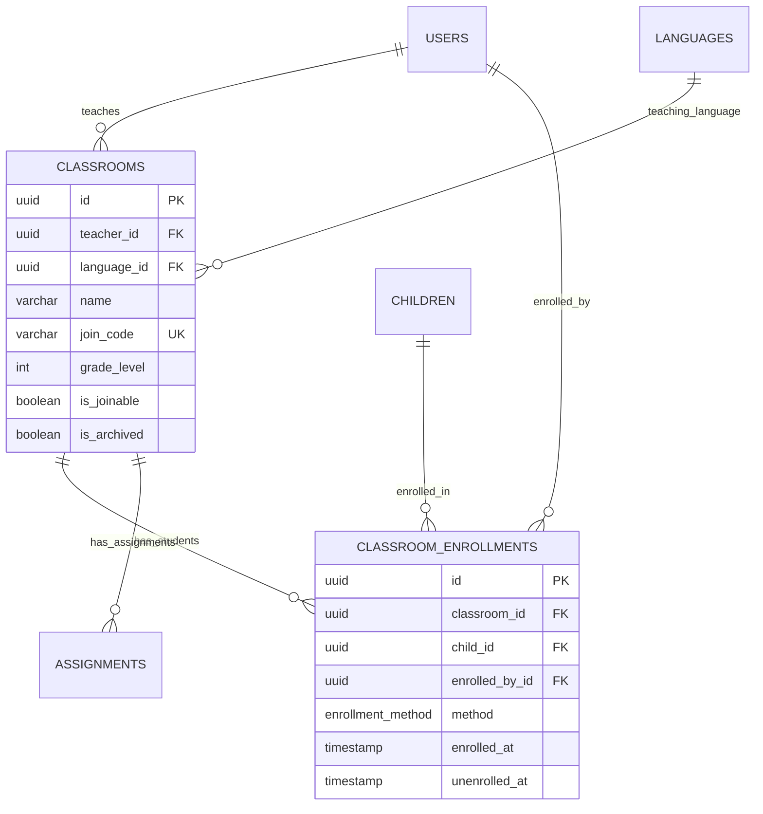

# 05. Classroom Management

[← Previous: Testing & Assessment](./04-testing-assessment.md) | [Back to Overview](./README.md) | [Next: Assignments & Learning →](./06-assignments-learning.md)

---

## 📋 Overview

Classroom management enables teachers to organize students, create virtual classrooms, and manage enrollments. This domain supports the teacher workflow where they can add children, track their progress, and assign learning activities.

### Tables in this Domain
- `classrooms` - Teacher-created virtual classrooms
- `classroom_enrollments` - Student membership in classrooms

### Key Concepts
- **Join Codes**: Unique codes (e.g., "ABC123") for easy student enrollment
- **Multi-Classroom**: One child can be enrolled in multiple classrooms (different teachers)
- **Enrollment Tracking**: Track who enrolled the child and when
- **Soft Archiving**: Classrooms are archived, not deleted

---

## 🗂️ Tables

### classrooms

Virtual classrooms created by teachers to organize and manage groups of students.

#### Schema

| Column | Type | Constraints | Description |
|--------|------|-------------|-------------|
| `id` | uuid | PRIMARY KEY | Unique identifier |
| `teacher_id` | uuid | NOT NULL, FK | Classroom owner (references users.id) |
| `language_id` | uuid | NOT NULL, FK | Primary teaching language |
| **Basic Info** |
| `name` | varchar(200) | NOT NULL | Classroom name (e.g., "3rd Grade Reading") |
| `description` | text | | Additional details |
| `grade_level` | int | | 1-12 (optional) |
| **Access Control** |
| `join_code` | varchar(10) | UNIQUE, NOT NULL | Auto-generated join code |
| `is_joinable` | boolean | DEFAULT true | Can students use join code? |
| **Status** |
| `is_archived` | boolean | DEFAULT false | Soft delete |
| `archived_at` | timestamp | | When archived |
| **Audit** |
| `created_at` | timestamp | DEFAULT now() | Classroom created |
| `updated_at` | timestamp | DEFAULT now() | Last modified |

#### Indexes
```sql
CREATE INDEX idx_classrooms_teacher ON classrooms(teacher_id);
CREATE INDEX idx_classrooms_code ON classrooms(join_code);
CREATE INDEX idx_classrooms_teacher_active 
  ON classrooms(teacher_id, is_archived);
CREATE INDEX idx_classrooms_language ON classrooms(language_id);
```

#### Join Code Generation
```sql
CREATE OR REPLACE FUNCTION generate_join_code() 
RETURNS varchar(10) AS $$
DECLARE
  chars varchar := 'ABCDEFGHJKLMNPQRSTUVWXYZ23456789'; -- No confusing chars
  result varchar := '';
  i int;
BEGIN
  FOR i IN 1..6 LOOP
    result := result || substr(chars, floor(random() * length(chars) + 1)::int, 1);
  END LOOP;
  RETURN result;
END;
$$ LANGUAGE plpgsql;

-- Auto-generate unique join code
CREATE OR REPLACE FUNCTION set_join_code()
RETURNS TRIGGER AS $$
DECLARE
  new_code varchar(10);
  code_exists boolean;
BEGIN
  IF NEW.join_code IS NULL THEN
    LOOP
      new_code := generate_join_code();
      SELECT EXISTS(SELECT 1 FROM classrooms WHERE join_code = new_code) INTO code_exists;
      EXIT WHEN NOT code_exists;
    END LOOP;
    NEW.join_code := new_code;
  END IF;
  RETURN NEW;
END;
$$ LANGUAGE plpgsql;

CREATE TRIGGER before_classroom_insert
BEFORE INSERT ON classrooms
FOR EACH ROW
EXECUTE FUNCTION set_join_code();
```

#### Example Data
```sql
INSERT INTO classrooms (
  teacher_id, language_id, name, description, grade_level
) VALUES (
  :teacher_id,
  (SELECT id FROM languages WHERE code = 'en'),
  '3rd Grade Reading - Room 204',
  'Morning reading class focusing on fluency',
  3
);
-- Join code auto-generated: e.g., "ABC123"
```

---

### classroom_enrollments

Tracks which children are enrolled in which classrooms, with enrollment history.

#### Schema

| Column | Type | Constraints | Description |
|--------|------|-------------|-------------|
| `id` | uuid | PRIMARY KEY | Unique identifier |
| `classroom_id` | uuid | NOT NULL, FK | References classrooms.id |
| `child_id` | uuid | NOT NULL, FK | References children.id |
| **Enrollment Details** |
| `enrolled_by_id` | uuid | NOT NULL, FK | User who added child (teacher or parent) |
| `enrollment_method` | enrollment_method | | JOIN_CODE, TEACHER_ADD, PARENT_ADD |
| **Status** |
| `enrolled_at` | timestamp | DEFAULT now() | When child joined |
| `unenrolled_at` | timestamp | | When child left (null = still enrolled) |
| `unenrolled_by_id` | uuid | FK | User who removed child |

#### Indexes
```sql
CREATE UNIQUE INDEX idx_enrollments_unique 
  ON classroom_enrollments(classroom_id, child_id) 
  WHERE unenrolled_at IS NULL;
CREATE INDEX idx_enrollments_classroom ON classroom_enrollments(classroom_id);
CREATE INDEX idx_enrollments_child ON classroom_enrollments(child_id);
CREATE INDEX idx_enrollments_active 
  ON classroom_enrollments(classroom_id) 
  WHERE unenrolled_at IS NULL;
```

#### Enrollment Types
```sql
CREATE TYPE enrollment_method AS ENUM (
  'JOIN_CODE',     -- Parent/child used join code
  'TEACHER_ADD',   -- Teacher manually added child
  'PARENT_ADD'     -- Parent enrolled their own child
);
```

#### Business Logic
```sql
-- Auto-create guardian relationship when teacher enrolls child
CREATE OR REPLACE FUNCTION create_teacher_guardian()
RETURNS TRIGGER AS $$
DECLARE
  teacher_id uuid;
BEGIN
  -- Get classroom teacher
  SELECT c.teacher_id INTO teacher_id
  FROM classrooms c
  WHERE c.id = NEW.classroom_id;
  
  -- Create guardian relationship if doesn't exist
  INSERT INTO child_guardians (
    child_id, guardian_id, relationship, claimed_via, can_manage_profile
  ) VALUES (
    NEW.child_id, teacher_id, 'TEACHER', 'TEACHER_ASSIGNED', false
  )
  ON CONFLICT (child_id, guardian_id) DO NOTHING;
  
  RETURN NEW;
END;
$$ LANGUAGE plpgsql;

CREATE TRIGGER after_enrollment_insert
AFTER INSERT ON classroom_enrollments
FOR EACH ROW
EXECUTE FUNCTION create_teacher_guardian();
```

---

## 🔗 Relationships



---

## 🎯 Business Rules

### Classrooms
1. **Join Code Uniqueness**: Each classroom has a unique 6-character code
2. **Teacher Ownership**: Only the teacher can modify their classroom
3. **Language Consistency**: All content in classroom should match `language_id`
4. **Archive vs Delete**: Never hard delete - use `is_archived = true`
5. **Join Code Disable**: Set `is_joinable = false` to prevent new enrollments

### Enrollments
1. **No Duplicates**: One child can only be enrolled once per classroom (active)
2. **Re-enrollment**: Child can be re-enrolled after unenrollment
3. **Auto-Guardian**: Teacher becomes guardian when enrolling child
4. **Notification**: Notify parents when child is enrolled by teacher
5. **Soft Unenroll**: Set `unenrolled_at` instead of deleting record

---

## 🔍 Common Queries

### Get teacher's active classrooms
```sql
SELECT 
  c.id,
  c.name,
  c.join_code,
  c.grade_level,
  c.is_joinable,
  c.created_at,
  COUNT(ce.id) FILTER (WHERE ce.unenrolled_at IS NULL) as active_students,
  COUNT(DISTINCT a.id) as total_assignments
FROM classrooms c
LEFT JOIN classroom_enrollments ce ON ce.classroom_id = c.id
LEFT JOIN assignments a ON a.classroom_id = c.id
WHERE c.teacher_id = :teacher_id
  AND c.is_archived = false
GROUP BY c.id
ORDER BY c.created_at DESC;
```

### Get classroom roster with test results
```sql
SELECT 
  ch.id,
  ch.first_name || ' ' || ch.last_name as student_name,
  calculate_age(ch.date_of_birth) as age,
  ch.current_risk_level,
  ch.last_tested_at,
  ce.enrolled_at,
  ce.enrollment_method,
  COUNT(DISTINCT t.id) as total_tests,
  json_agg(DISTINCT jsonb_build_object(
    'guardian_name', u.full_name,
    'guardian_email', u.email,
    'relationship', cg.relationship
  )) as guardians
FROM classroom_enrollments ce
JOIN children ch ON ch.id = ce.child_id
LEFT JOIN tests t ON t.child_id = ch.id
LEFT JOIN child_guardians cg ON cg.child_id = ch.id
LEFT JOIN users u ON u.id = cg.guardian_id
WHERE ce.classroom_id = :classroom_id
  AND ce.unenrolled_at IS NULL
  AND ch.is_active = true
GROUP BY ch.id, ce.enrolled_at, ce.enrollment_method
ORDER BY ch.last_name, ch.first_name;
```

### Find classroom by join code
```sql
SELECT 
  c.*,
  u.full_name as teacher_name,
  l.name as language_name,
  COUNT(ce.id) FILTER (WHERE ce.unenrolled_at IS NULL) as student_count
FROM classrooms c
JOIN users u ON u.id = c.teacher_id
JOIN languages l ON l.id = c.language_id
LEFT JOIN classroom_enrollments ce ON ce.classroom_id = c.id
WHERE c.join_code = :join_code
  AND c.is_archived = false
  AND c.is_joinable = true
GROUP BY c.id, u.full_name, l.name;
```

### Get child's classrooms
```sql
SELECT 
  c.id,
  c.name,
  c.grade_level,
  u.full_name as teacher_name,
  u.email as teacher_email,
  ce.enrolled_at,
  ce.enrollment_method
FROM classroom_enrollments ce
JOIN classrooms c ON c.id = ce.classroom_id
JOIN users u ON u.id = c.teacher_id
WHERE ce.child_id = :child_id
  AND ce.unenrolled_at IS NULL
  AND c.is_archived = false
ORDER BY ce.enrolled_at DESC;
```

### Get enrollment statistics
```sql
SELECT 
  DATE_TRUNC('month', ce.enrolled_at) as month,
  COUNT(*) as total_enrollments,
  COUNT(*) FILTER (WHERE ce.enrollment_method = 'JOIN_CODE') as via_join_code,
  COUNT(*) FILTER (WHERE ce.enrollment_method = 'TEACHER_ADD') as teacher_added,
  COUNT(*) FILTER (WHERE ce.enrollment_method = 'PARENT_ADD') as parent_added,
  COUNT(*) FILTER (WHERE ce.unenrolled_at IS NOT NULL) as unenrolled
FROM classroom_enrollments ce
WHERE ce.enrolled_at >= CURRENT_DATE - INTERVAL '6 months'
GROUP BY month
ORDER BY month DESC;
```

---

## 🚀 API Examples

### Create classroom
```python
@router.post("/classrooms")
async def create_classroom(
    classroom_data: ClassroomCreate,
    current_user: User = Depends(get_current_teacher),
    db: Database = Depends(get_db)
):
    # Verify user is a teacher
    if current_user.role != 'TEACHER':
        raise HTTPException(403, "Only teachers can create classrooms")
    
    # Create classroom (join_code auto-generated by trigger)
    classroom_id = await db.execute("""
        INSERT INTO classrooms (
            teacher_id, language_id, name, 
            description, grade_level
        ) VALUES (
            :teacher_id, :language_id, :name,
            :description, :grade_level
        )
        RETURNING id
    """, {
        "teacher_id": current_user.id,
        "language_id": classroom_data.language_id,
        "name": classroom_data.name,
        "description": classroom_data.description,
        "grade_level": classroom_data.grade_level
    })
    
    # Get the auto-generated join code
    classroom = await db.fetchone("""
        SELECT id, name, join_code 
        FROM classrooms 
        WHERE id = :id
    """, {"id": classroom_id})
    
    return {
        "id": classroom["id"],
        "name": classroom["name"],
        "join_code": classroom["join_code"],
        "message": "Classroom created successfully"
    }
```

### Enroll child via join code
```python
@router.post("/classrooms/join")
async def join_classroom(
    join_data: JoinClassroom,
    current_user: User = Depends(get_current_user),
    db: Database = Depends(get_db)
):
    # Find classroom by join code
    classroom = await db.fetchone("""
        SELECT id, teacher_id, name, is_joinable
        FROM classrooms
        WHERE join_code = :code
          AND is_archived = false
    """, {"code": join_data.join_code.upper()})
    
    if not classroom:
        raise HTTPException(404, "Invalid join code")
    
    if not classroom["is_joinable"]:
        raise HTTPException(403, "This classroom is not accepting new students")
    
    # Verify child belongs to user
    is_guardian = await db.fetchone("""
        SELECT 1 FROM child_guardians
        WHERE child_id = :child_id
          AND guardian_id = :user_id
    """, {
        "child_id": join_data.child_id,
        "user_id": current_user.id
    })
    
    if not is_guardian:
        raise HTTPException(403, "You don't have permission to enroll this child")
    
    # Check if already enrolled
    existing = await db.fetchone("""
        SELECT id FROM classroom_enrollments
        WHERE classroom_id = :classroom_id
          AND child_id = :child_id
          AND unenrolled_at IS NULL
    """, {
        "classroom_id": classroom["id"],
        "child_id": join_data.child_id
    })
    
    if existing:
        raise HTTPException(400, "Child is already enrolled in this classroom")
    
    # Enroll child
    await db.execute("""
        INSERT INTO classroom_enrollments (
            classroom_id, child_id, enrolled_by_id, enrollment_method
        ) VALUES (
            :classroom_id, :child_id, :user_id, 'JOIN_CODE'
        )
    """, {
        "classroom_id": classroom["id"],
        "child_id": join_data.child_id,
        "user_id": current_user.id
    })
    
    # Notify teacher
    await send_notification(
        user_id=classroom["teacher_id"],
        notification_type="ENROLLMENT_NEW",
        title="New Student Enrolled",
        message=f"A new student joined {classroom['name']}",
        related_child_id=join_data.child_id
    )
    
    return {
        "classroom_name": classroom["name"],
        "message": "Successfully enrolled in classroom"
    }
```

### Teacher adds child to classroom
```python
@router.post("/classrooms/{classroom_id}/students")
async def add_student_to_classroom(
    classroom_id: UUID,
    student_data: AddStudent,
    current_user: User = Depends(get_current_teacher),
    db: Database = Depends(get_db)
):
    # Verify teacher owns classroom
    classroom = await db.fetchone("""
        SELECT id, teacher_id, name
        FROM classrooms
        WHERE id = :id AND teacher_id = :teacher_id
    """, {"id": classroom_id, "teacher_id": current_user.id})
    
    if not classroom:
        raise HTTPException(404, "Classroom not found or you don't own it")
    
    # Create child if providing new child data
    if student_data.create_new:
        child_id = await db.execute("""
            INSERT INTO children (
                primary_language_id, first_name, last_name,
                date_of_birth, grade_level
            ) VALUES (
                :language_id, :first_name, :last_name,
                :dob, :grade_level
            )
            RETURNING id
        """, {
            "language_id": student_data.language_id,
            "first_name": student_data.first_name,
            "last_name": student_data.last_name,
            "dob": student_data.date_of_birth,
            "grade_level": student_data.grade_level
        })
    else:
        child_id = student_data.child_id
    
    # Enroll child
    await db.execute("""
        INSERT INTO classroom_enrollments (
            classroom_id, child_id, enrolled_by_id, enrollment_method
        ) VALUES (
            :classroom_id, :child_id, :teacher_id, 'TEACHER_ADD'
        )
    """, {
        "classroom_id": classroom_id,
        "child_id": child_id,
        "teacher_id": current_user.id
    })
    
    # Teacher-guardian relationship created by trigger
    
    return {
        "child_id": child_id,
        "message": "Student added to classroom"
    }
```

### Unenroll student
```python
@router.delete("/classrooms/{classroom_id}/students/{child_id}")
async def remove_student(
    classroom_id: UUID,
    child_id: UUID,
    current_user: User = Depends(get_current_teacher),
    db: Database = Depends(get_db)
):
    # Verify teacher owns classroom
    classroom = await db.fetchone("""
        SELECT id FROM classrooms
        WHERE id = :id AND teacher_id = :teacher_id
    """, {"id": classroom_id, "teacher_id": current_user.id})
    
    if not classroom:
        raise HTTPException(403, "Not authorized")
    
    # Unenroll child
    result = await db.execute("""
        UPDATE classroom_enrollments
        SET 
            unenrolled_at = now(),
            unenrolled_by_id = :teacher_id
        WHERE classroom_id = :classroom_id
          AND child_id = :child_id
          AND unenrolled_at IS NULL
    """, {
        "classroom_id": classroom_id,
        "child_id": child_id,
        "teacher_id": current_user.id
    })
    
    if result == 0:
        raise HTTPException(404, "Student not found in classroom")
    
    return {"message": "Student removed from classroom"}
```

---

## 📊 Analytics Queries

### Teacher dashboard stats
```sql
SELECT 
  u.full_name as teacher_name,
  COUNT(DISTINCT c.id) as total_classrooms,
  COUNT(DISTINCT ce.child_id) FILTER (WHERE ce.unenrolled_at IS NULL) as active_students,
  COUNT(DISTINCT a.id) as total_assignments,
  COUNT(DISTINCT t.id) as tests_conducted
FROM users u
LEFT JOIN classrooms c ON c.teacher_id = u.id AND c.is_archived = false
LEFT JOIN classroom_enrollments ce ON ce.classroom_id = c.id
LEFT JOIN assignments a ON a.classroom_id = c.id
LEFT JOIN tests t ON t.conducted_by_id = u.id
WHERE u.id = :teacher_id
GROUP BY u.id, u.full_name;
```

### Classroom growth over time
```sql
SELECT 
  c.name as classroom_name,
  DATE_TRUNC('week', ce.enrolled_at) as week,
  COUNT(*) as new_enrollments,
  SUM(COUNT(*)) OVER (
    PARTITION BY c.id 
    ORDER BY DATE_TRUNC('week', ce.enrolled_at)
  ) as cumulative_students
FROM classrooms c
JOIN classroom_enrollments ce ON ce.classroom_id = c.id
WHERE c.id = :classroom_id
GROUP BY c.id, c.name, week
ORDER BY week;
```

---

## ✅ Best Practices

1. **Join Code Security**: Don't expose join codes publicly; share only with intended users
2. **Permission Checks**: Always verify teacher owns classroom before allowing modifications
3. **Soft Deletes**: Archive classrooms instead of deleting (preserves history)
4. **Notification**: Always notify parents when their child is enrolled by a teacher
5. **Guardian Relationships**: Teacher-guardian relationships are auto-created but have limited permissions
6. **Re-enrollment**: Allow children to be re-enrolled after unenrollment (useful for next school year)

---

[← Previous: Testing & Assessment](./04-testing-assessment.md) | [Back to Overview](./README.md) | [Next: Assignments & Learning →](./06-assignments-learning.md)
