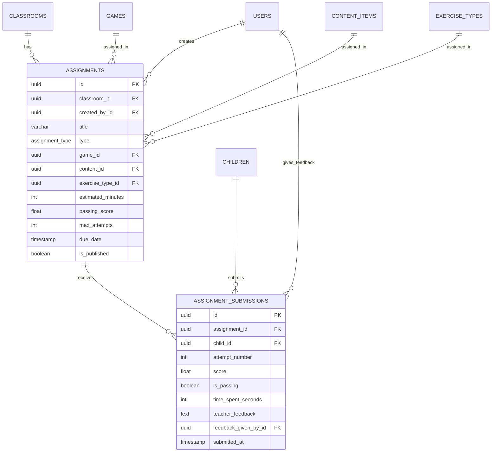

# 06. Assignments & Learning

[← Previous: Classroom Management](./05-classroom-management.md) | [Back to Overview](./README.md) | [Next: Sessions & Activities →](./07-sessions-activities.md)

---

## 📋 Overview

This domain manages teacher-created assignments and student submissions. Teachers can assign games, reading materials, or exercises to their classrooms, and track student completion and performance.

### Tables in this Domain
- `assignments` - Teacher-created homework and activities
- `assignment_submissions` - Student work submitted for assignments

### Key Concepts
- **Assignment Types**: GAME, READING, EXERCISE, or MIXED
- **Multiple Attempts**: Students can retry assignments (configurable)
- **Passing Scores**: Optional threshold for completion
- **Teacher Feedback**: Teachers can comment on submissions

---

## 🗂️ Tables

### assignments

Homework, activities, or assessments created by teachers for their classrooms.

#### Schema

| Column | Type | Constraints | Description |
|--------|------|-------------|-------------|
| `id` | uuid | PRIMARY KEY | Unique identifier |
| `classroom_id` | uuid | NOT NULL, FK | Classroom receiving assignment |
| `created_by_id` | uuid | NOT NULL, FK | Teacher who created it |
| **Basic Info** |
| `title` | varchar(200) | NOT NULL | Assignment name |
| `description` | text | | Detailed instructions |
| `instructions` | text | | Step-by-step directions |
| **Type and Content** |
| `assignment_type` | assignment_type | NOT NULL | GAME, READING, EXERCISE, MIXED |
| `game_id` | uuid | FK | If type = GAME |
| `content_id` | uuid | FK | If type = READING |
| `exercise_type_id` | uuid | FK | If type = EXERCISE |
| **Configuration** |
| `estimated_minutes` | int | | Expected completion time |
| `passing_score` | float | | 0-100, null = no threshold |
| `max_attempts` | int | | NULL = unlimited |
| **Scheduling** |
| `assigned_at` | timestamp | DEFAULT now() | When made available |
| `due_date` | timestamp | | Deadline (optional) |
| `is_published` | boolean | DEFAULT true | Visible to students |
| **Audit** |
| `created_at` | timestamp | DEFAULT now() | Created timestamp |
| `updated_at` | timestamp | DEFAULT now() | Last modified |

#### Indexes
```sql
CREATE INDEX idx_assignments_classroom ON assignments(classroom_id);
CREATE INDEX idx_assignments_classroom_due 
  ON assignments(classroom_id, due_date);
CREATE INDEX idx_assignments_type ON assignments(assignment_type);
CREATE INDEX idx_assignments_published 
  ON assignments(is_published) 
  WHERE is_published = true;
```

#### Assignment Types
```sql
CREATE TYPE assignment_type AS ENUM (
  'GAME',      -- Complete specific game level
  'READING',   -- Read specific content
  'EXERCISE',  -- Complete practice exercises
  'MIXED'      -- Combination of activities
);
```

#### Validation
```sql
-- Ensure correct FK is set based on type
CREATE OR REPLACE FUNCTION validate_assignment_type()
RETURNS TRIGGER AS $$
BEGIN
  IF NEW.assignment_type = 'GAME' AND NEW.game_id IS NULL THEN
    RAISE EXCEPTION 'GAME assignments must have game_id';
  END IF;
  
  IF NEW.assignment_type = 'READING' AND NEW.content_id IS NULL THEN
    RAISE EXCEPTION 'READING assignments must have content_id';
  END IF;
  
  IF NEW.assignment_type = 'EXERCISE' AND NEW.exercise_type_id IS NULL THEN
    RAISE EXCEPTION 'EXERCISE assignments must have exercise_type_id';
  END IF;
  
  RETURN NEW;
END;
$$ LANGUAGE plpgsql;

CREATE TRIGGER before_assignment_insert
BEFORE INSERT OR UPDATE ON assignments
FOR EACH ROW
EXECUTE FUNCTION validate_assignment_type();
```

---

### assignment_submissions

Student work submitted for assignments, tracking attempts and scores.

#### Schema

| Column | Type | Constraints | Description |
|--------|------|-------------|-------------|
| `id` | uuid | PRIMARY KEY | Unique identifier |
| `assignment_id` | uuid | NOT NULL, FK | Which assignment |
| `child_id` | uuid | NOT NULL, FK | Which student |
| `attempt_number` | int | NOT NULL, DEFAULT 1 | 1st, 2nd, 3rd attempt |
| **Results** |
| `score` | float | | 0-100 |
| `is_passing` | boolean | | Met passing_score threshold |
| `time_spent_seconds` | int | | Time to complete |
| **Feedback** |
| `teacher_feedback` | text | | Teacher's comments |
| `feedback_given_by_id` | uuid | FK | Teacher who gave feedback |
| `feedback_given_at` | timestamp | | When feedback was added |
| **Audit** |
| `submitted_at` | timestamp | DEFAULT now() | Submission timestamp |

#### Indexes
```sql
CREATE INDEX idx_submissions_assignment_child 
  ON assignment_submissions(assignment_id, child_id);
CREATE INDEX idx_submissions_assignment 
  ON assignment_submissions(assignment_id);
CREATE INDEX idx_submissions_child 
  ON assignment_submissions(child_id);
CREATE INDEX idx_submissions_recent 
  ON assignment_submissions(submitted_at DESC);
```

#### Auto-Calculate Passing Status
```sql
CREATE OR REPLACE FUNCTION calculate_passing_status()
RETURNS TRIGGER AS $$
DECLARE
  passing_threshold float;
BEGIN
  -- Get passing score from assignment
  SELECT passing_score INTO passing_threshold
  FROM assignments
  WHERE id = NEW.assignment_id;
  
  -- Determine if passing
  IF passing_threshold IS NULL THEN
    NEW.is_passing := true;  -- No threshold = always passing
  ELSE
    NEW.is_passing := (NEW.score >= passing_threshold);
  END IF;
  
  RETURN NEW;
END;
$$ LANGUAGE plpgsql;

CREATE TRIGGER before_submission_insert
BEFORE INSERT OR UPDATE ON assignment_submissions
FOR EACH ROW
WHEN (NEW.score IS NOT NULL)
EXECUTE FUNCTION calculate_passing_status();
```

#### Attempt Number Auto-Increment
```sql
CREATE OR REPLACE FUNCTION set_attempt_number()
RETURNS TRIGGER AS $$
DECLARE
  max_attempt int;
  assignment_max_attempts int;
BEGIN
  -- Get current max attempt for this student-assignment combo
  SELECT COALESCE(MAX(attempt_number), 0) INTO max_attempt
  FROM assignment_submissions
  WHERE assignment_id = NEW.assignment_id
    AND child_id = NEW.child_id;
  
  -- Get max attempts allowed
  SELECT max_attempts INTO assignment_max_attempts
  FROM assignments
  WHERE id = NEW.assignment_id;
  
  -- Check if exceeded
  IF assignment_max_attempts IS NOT NULL 
     AND max_attempt >= assignment_max_attempts THEN
    RAISE EXCEPTION 'Maximum attempts (%) exceeded for this assignment', 
      assignment_max_attempts;
  END IF;
  
  -- Set next attempt number
  NEW.attempt_number := max_attempt + 1;
  
  RETURN NEW;
END;
$$ LANGUAGE plpgsql;

CREATE TRIGGER before_submission_set_attempt
BEFORE INSERT ON assignment_submissions
FOR EACH ROW
EXECUTE FUNCTION set_attempt_number();
```

---

## 🔗 Relationships



---

## 🎯 Business Rules

### Assignments
1. **Type Consistency**: Assignment must have correct FK for its type
2. **Classroom Membership**: Only students enrolled in classroom see assignment
3. **Due Dates**: Optional, but recommended for time management
4. **Passing Score**: If set, must be 0-100
5. **Publishing**: Draft assignments (`is_published = false`) invisible to students

### Submissions
1. **Attempt Limits**: Cannot exceed `max_attempts` if set
2. **Auto-Passing**: If no passing_score set, all submissions pass
3. **Best Score**: Track best score across all attempts
4. **Feedback Timing**: Teachers can add feedback after submission
5. **Resubmission**: New attempt creates new submission record

---

## 🔍 Common Queries

### Get classroom assignments
```sql
SELECT 
  a.id,
  a.title,
  a.description,
  a.assignment_type,
  a.due_date,
  a.passing_score,
  a.estimated_minutes,
  CASE 
    WHEN a.assignment_type = 'GAME' THEN g.name
    WHEN a.assignment_type = 'READING' THEN c.title
    WHEN a.assignment_type = 'EXERCISE' THEN et.name
  END as content_name,
  COUNT(DISTINCT s.child_id) FILTER (
    WHERE s.is_passing = true
  ) as students_completed,
  COUNT(DISTINCT ce.child_id) as total_students
FROM assignments a
LEFT JOIN games g ON g.id = a.game_id
LEFT JOIN content_items c ON c.id = a.content_id
LEFT JOIN exercise_types et ON et.id = a.exercise_type_id
LEFT JOIN assignment_submissions s ON s.assignment_id = a.id
LEFT JOIN classroom_enrollments ce ON ce.classroom_id = a.classroom_id
  AND ce.unenrolled_at IS NULL
WHERE a.classroom_id = :classroom_id
  AND a.is_published = true
GROUP BY a.id, g.name, c.title, et.name
ORDER BY 
  CASE WHEN a.due_date IS NULL THEN 1 ELSE 0 END,
  a.due_date ASC,
  a.created_at DESC;
```

### Get student's assignments (with completion status)
```sql
WITH student_classrooms AS (
  SELECT classroom_id
  FROM classroom_enrollments
  WHERE child_id = :child_id
    AND unenrolled_at IS NULL
),
best_scores AS (
  SELECT 
    assignment_id,
    child_id,
    MAX(score) as best_score,
    MAX(attempt_number) as total_attempts,
    BOOL_OR(is_passing) as has_passed
  FROM assignment_submissions
  WHERE child_id = :child_id
  GROUP BY assignment_id, child_id
)
SELECT 
  a.id,
  a.title,
  a.description,
  a.assignment_type,
  a.due_date,
  a.passing_score,
  a.estimated_minutes,
  CASE WHEN a.due_date < now() THEN true ELSE false END as is_overdue,
  bs.best_score,
  bs.total_attempts,
  bs.has_passed,
  CASE 
    WHEN bs.has_passed THEN 'completed'
    WHEN bs.best_score IS NOT NULL THEN 'in_progress'
    ELSE 'not_started'
  END as status
FROM assignments a
JOIN student_classrooms sc ON sc.classroom_id = a.classroom_id
LEFT JOIN best_scores bs ON bs.assignment_id = a.id
WHERE a.is_published = true
ORDER BY 
  CASE 
    WHEN bs.has_passed THEN 3
    WHEN bs.best_score IS NOT NULL THEN 2
    ELSE 1
  END,
  COALESCE(a.due_date, 'infinity'::timestamp) ASC;
```

### Get assignment details with submissions
```sql
SELECT 
  a.*,
  c.name as classroom_name,
  u.full_name as teacher_name,
  json_agg(
    json_build_object(
      'child_name', ch.first_name || ' ' || ch.last_name,
      'child_id', s.child_id,
      'score', s.score,
      'is_passing', s.is_passing,
      'attempt', s.attempt_number,
      'time_spent_minutes', ROUND(s.time_spent_seconds / 60.0, 1),
      'submitted_at', s.submitted_at,
      'has_feedback', s.teacher_feedback IS NOT NULL
    ) ORDER BY s.submitted_at DESC
  ) FILTER (WHERE s.id IS NOT NULL) as submissions
FROM assignments a
JOIN classrooms c ON c.id = a.classroom_id
JOIN users u ON u.id = a.created_by_id
LEFT JOIN assignment_submissions s ON s.assignment_id = a.id
LEFT JOIN children ch ON ch.id = s.child_id
WHERE a.id = :assignment_id
GROUP BY a.id, c.name, u.full_name;
```

### Get completion statistics
```sql
SELECT 
  DATE_TRUNC('week', a.created_at) as week,
  COUNT(DISTINCT a.id) as assignments_created,
  COUNT(DISTINCT s.id) as total_submissions,
  COUNT(DISTINCT s.id) FILTER (WHERE s.is_passing) as passing_submissions,
  ROUND(AVG(s.score), 1) as average_score,
  ROUND(AVG(s.time_spent_seconds / 60.0), 1) as avg_time_minutes
FROM assignments a
LEFT JOIN assignment_submissions s ON s.assignment_id = a.id
WHERE a.classroom_id = :classroom_id
  AND a.created_at >= CURRENT_DATE - INTERVAL '3 months'
GROUP BY week
ORDER BY week DESC;
```

---

## 🚀 API Examples

### Create assignment
```python
@router.post("/classrooms/{classroom_id}/assignments")
async def create_assignment(
    classroom_id: UUID,
    assignment_data: AssignmentCreate,
    current_user: User = Depends(get_current_teacher),
    db: Database = Depends(get_db)
):
    # Verify teacher owns classroom
    classroom = await db.fetchone("""
        SELECT id FROM classrooms
        WHERE id = :id AND teacher_id = :teacher_id
    """, {"id": classroom_id, "teacher_id": current_user.id})
    
    if not classroom:
        raise HTTPException(403, "Not authorized")
    
    # Validate type-specific fields
    type_fields = {
        "GAME": assignment_data.game_id,
        "READING": assignment_data.content_id,
        "EXERCISE": assignment_data.exercise_type_id
    }
    
    if not type_fields.get(assignment_data.assignment_type):
        raise HTTPException(400, f"Missing required field for {assignment_data.assignment_type} assignment")
    
    # Create assignment
    assignment_id = await db.execute("""
        INSERT INTO assignments (
            classroom_id, created_by_id, title, description,
            instructions, assignment_type, game_id, content_id,
            exercise_type_id, estimated_minutes, passing_score,
            max_attempts, due_date, is_published
        ) VALUES (
            :classroom_id, :teacher_id, :title, :description,
            :instructions, :type, :game_id, :content_id,
            :exercise_type_id, :minutes, :passing_score,
            :max_attempts, :due_date, :published
        )
        RETURNING id
    """, {
        "classroom_id": classroom_id,
        "teacher_id": current_user.id,
        "title": assignment_data.title,
        "description": assignment_data.description,
        "instructions": assignment_data.instructions,
        "type": assignment_data.assignment_type,
        "game_id": assignment_data.game_id,
        "content_id": assignment_data.content_id,
        "exercise_type_id": assignment_data.exercise_type_id,
        "minutes": assignment_data.estimated_minutes,
        "passing_score": assignment_data.passing_score,
        "max_attempts": assignment_data.max_attempts,
        "due_date": assignment_data.due_date,
        "published": assignment_data.is_published
    })
    
    # Notify students (if published)
    if assignment_data.is_published:
        await notify_classroom_students(
            classroom_id=classroom_id,
            notification_type="ASSIGNMENT_CREATED",
            title=f"New Assignment: {assignment_data.title}",
            message=assignment_data.description,
            related_assignment_id=assignment_id,
            db=db
        )
    
    return {
        "id": assignment_id,
        "message": "Assignment created successfully"
    }
```

### Submit assignment
```python
@router.post("/assignments/{assignment_id}/submit")
async def submit_assignment(
    assignment_id: UUID,
    submission_data: SubmissionCreate,
    current_user: User = Depends(get_current_user),
    db: Database = Depends(get_db)
):
    # Get assignment details
    assignment = await db.fetchone("""
        SELECT a.*, c.teacher_id
        FROM assignments a
        JOIN classrooms c ON c.id = a.classroom_id
        WHERE a.id = :id AND a.is_published = true
    """, {"id": assignment_id})
    
    if not assignment:
        raise HTTPException(404, "Assignment not found")
    
    # Verify child is in classroom
    enrolled = await db.fetchone("""
        SELECT 1 FROM classroom_enrollments
        WHERE classroom_id = :classroom_id
          AND child_id = :child_id
          AND unenrolled_at IS NULL
    """, {
        "classroom_id": assignment["classroom_id"],
        "child_id": submission_data.child_id
    })
    
    if not enrolled:
        raise HTTPException(403, "Child not enrolled in this classroom")
    
    # Verify user is guardian
    is_guardian = await db.fetchone("""
        SELECT 1 FROM child_guardians
        WHERE child_id = :child_id AND guardian_id = :user_id
    """, {
        "child_id": submission_data.child_id,
        "user_id": current_user.id
    })
    
    if not is_guardian:
        raise HTTPException(403, "Not authorized")
    
    # Check if past due date
    if assignment["due_date"] and assignment["due_date"] < datetime.now():
        # Allow but flag as late
        is_late = True
    else:
        is_late = False
    
    # Submit (attempt number auto-incremented by trigger)
    try:
        submission_id = await db.execute("""
            INSERT INTO assignment_submissions (
                assignment_id, child_id, score, time_spent_seconds
            ) VALUES (
                :assignment_id, :child_id, :score, :time_seconds
            )
            RETURNING id
        """, {
            "assignment_id": assignment_id,
            "child_id": submission_data.child_id,
            "score": submission_data.score,
            "time_seconds": submission_data.time_spent_seconds
        })
    except Exception as e:
        if "Maximum attempts" in str(e):
            raise HTTPException(400, "Maximum attempts exceeded")
        raise
    
    # Get submission details (with is_passing calculated)
    submission = await db.fetchone("""
        SELECT * FROM assignment_submissions WHERE id = :id
    """, {"id": submission_id})
    
    # Notify teacher
    await send_notification(
        user_id=assignment["teacher_id"],
        notification_type="ASSIGNMENT_COMPLETED",
        title="Assignment Submitted",
        message=f"A student submitted: {assignment['title']}",
        related_assignment_id=assignment_id,
        related_child_id=submission_data.child_id
    )
    
    return {
        "submission_id": submission_id,
        "attempt_number": submission["attempt_number"],
        "score": submission["score"],
        "is_passing": submission["is_passing"],
        "is_late": is_late,
        "message": "Assignment submitted successfully"
    }
```

### Add teacher feedback
```python
@router.post("/submissions/{submission_id}/feedback")
async def add_feedback(
    submission_id: UUID,
    feedback_data: FeedbackCreate,
    current_user: User = Depends(get_current_teacher),
    db: Database = Depends(get_db)
):
    # Get submission and verify teacher owns classroom
    submission = await db.fetchone("""
        SELECT s.*, a.classroom_id, c.teacher_id, ch.first_name
        FROM assignment_submissions s
        JOIN assignments a ON a.id = s.assignment_id
        JOIN classrooms c ON c.id = a.classroom_id
        JOIN children ch ON ch.id = s.child_id
        WHERE s.id = :id
    """, {"id": submission_id})
    
    if not submission:
        raise HTTPException(404, "Submission not found")
    
    if submission["teacher_id"] != current_user.id:
        raise HTTPException(403, "Not authorized")
    
    # Add feedback
    await db.execute("""
        UPDATE assignment_submissions
        SET 
            teacher_feedback = :feedback,
            feedback_given_by_id = :teacher_id,
            feedback_given_at = now()
        WHERE id = :submission_id
    """, {
        "feedback": feedback_data.feedback,
        "teacher_id": current_user.id,
        "submission_id": submission_id
    })
    
    # Notify guardians
    guardians = await db.fetch("""
        SELECT guardian_id FROM child_guardians
        WHERE child_id = :child_id AND can_view_tests = true
    """, {"child_id": submission["child_id"]})
    
    for guardian in guardians:
        await send_notification(
            user_id=guardian["guardian_id"],
            notification_type="ASSIGNMENT_COMPLETED",
            title="Teacher Feedback Received",
            message=f"Feedback on {submission['first_name']}'s assignment",
            related_child_id=submission["child_id"]
        )
    
    return {"message": "Feedback added successfully"}
```

---

## 📊 Analytics Queries

### Assignment completion rates
```sql
SELECT 
  a.title,
  COUNT(DISTINCT ce.child_id) as total_students,
  COUNT(DISTINCT s.child_id) FILTER (
    WHERE s.is_passing = true
  ) as completed_count,
  ROUND(
    100.0 * COUNT(DISTINCT s.child_id) FILTER (WHERE s.is_passing = true) / 
    NULLIF(COUNT(DISTINCT ce.child_id), 0),
    1
  ) as completion_rate,
  ROUND(AVG(s.score) FILTER (WHERE s.is_passing), 1) as avg_passing_score
FROM assignments a
JOIN classroom_enrollments ce ON ce.classroom_id = a.classroom_id
  AND ce.unenrolled_at IS NULL
LEFT JOIN assignment_submissions s ON s.assignment_id = a.id
  AND s.child_id = ce.child_id
WHERE a.classroom_id = :classroom_id
  AND a.is_published = true
GROUP BY a.id, a.title
ORDER BY completion_rate DESC;
```

### Student performance summary
```sql
SELECT 
  ch.first_name || ' ' || ch.last_name as student_name,
  COUNT(DISTINCT a.id) as assignments_available,
  COUNT(DISTINCT s.assignment_id) as assignments_attempted,
  COUNT(DISTINCT s.assignment_id) FILTER (
    WHERE s.is_passing = true
  ) as assignments_completed,
  ROUND(AVG(s.score), 1) as average_score,
  SUM(s.time_spent_seconds) / 3600.0 as total_hours
FROM children ch
JOIN classroom_enrollments ce ON ce.child_id = ch.id
LEFT JOIN assignments a ON a.classroom_id = ce.classroom_id
  AND a.is_published = true
LEFT JOIN assignment_submissions s ON s.child_id = ch.id
  AND s.assignment_id = a.id
WHERE ce.classroom_id = :classroom_id
  AND ce.unenrolled_at IS NULL
GROUP BY ch.id, ch.first_name, ch.last_name
ORDER BY average_score DESC NULLS LAST;
```

---

## ✅ Best Practices

1. **Clear Instructions**: Provide detailed `description` and `instructions`
2. **Reasonable Due Dates**: Give students enough time (3-7 days typical)
3. **Passing Scores**: Set realistic thresholds (60-70% common)
4. **Attempt Limits**: Allow 2-3 attempts for practice, 1 for assessments
5. **Timely Feedback**: Provide teacher feedback within 48 hours
6. **Publish Carefully**: Review before setting `is_published = true`

---

[← Previous: Classroom Management](./05-classroom-management.md) | [Back to Overview](./README.md) | [Next: Sessions & Activities →](./07-sessions-activities.md)
