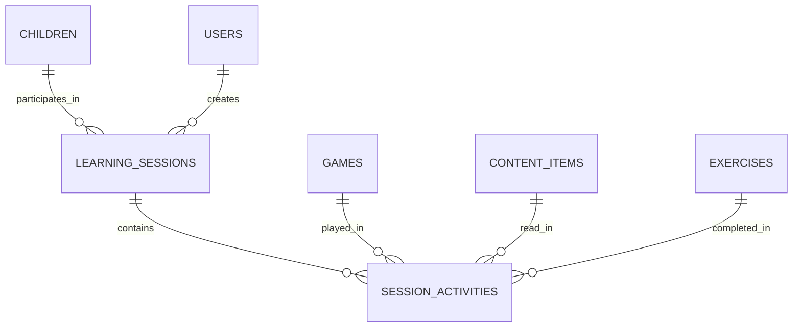

# 07. Sessions & Activities

[← Previous: Assignments & Learning](./06-assignments-learning.md) | [Back to Overview](./README.md) | [Next: Games & Progress →](./08-games-progress.md)

---

## 📋 Overview

Learning sessions provide structured, time-boxed learning experiences. Parents and teachers can create sessions for children to work through multiple activities in sequence.

### Tables in this Domain
- `learning_sessions` - Time-bound learning periods
- `session_activities` - Individual activities within sessions

### Key Concepts
- **Session Codes**: Quick 6-character codes for child login
- **Activity Sequence**: Activities completed in order
- **Mixed Content**: Sessions can include games, reading, and exercises
- **Time Tracking**: Precise activity duration tracking

---

## 🗂️ Tables

### learning_sessions

Structured learning periods created by parents or teachers.

#### Schema

| Column | Type | Constraints | Description |
|--------|------|-------------|-------------|
| `id` | uuid | PRIMARY KEY | Unique identifier |
| `child_id` | uuid | NOT NULL, FK | Student |
| `created_by_id` | uuid | NOT NULL, FK | Parent/teacher who created |
| `session_type` | session_type | NOT NULL | FREE_PLAY, GUIDED_LEARNING, ASSESSMENT, PRACTICE |
| `session_code` | varchar(10) | UNIQUE, NOT NULL | Quick join code |
| `title` | varchar(200) | | Session name |
| `planned_duration_minutes` | int | | Expected length |
| `started_at` | timestamp | DEFAULT now() | Session creation |
| `ended_at` | timestamp | | When session completed |
| `expires_at` | timestamp | NOT NULL | Auto-expire after 24h |

**Indexes:**
```sql
CREATE INDEX idx_sessions_child ON learning_sessions(child_id);
CREATE INDEX idx_sessions_code ON learning_sessions(session_code);
CREATE INDEX idx_sessions_child_recent ON learning_sessions(child_id, started_at DESC);
```

---

### session_activities

Individual activities (games, reading, exercises) within a session.

#### Schema

| Column | Type | Constraints | Description |
|--------|------|-------------|-------------|
| `id` | uuid | PRIMARY KEY | Unique identifier |
| `session_id` | uuid | NOT NULL, FK | Parent session |
| `activity_type` | activity_type | NOT NULL | GAME, READING, EXERCISE |
| `activity_order` | int | NOT NULL | Sequence (1, 2, 3...) |
| `game_id` | uuid | FK | If type = GAME |
| `content_id` | uuid | FK | If type = READING |
| `exercise_id` | uuid | FK | If type = EXERCISE |
| `score` | float | | 0-100 |
| `accuracy` | float | | 0.0-1.0 |
| `time_spent_seconds` | int | | Duration |
| `started_at` | timestamp | | Activity start |
| `completed_at` | timestamp | | Activity end |

**Indexes:**
```sql
CREATE INDEX idx_activities_session ON session_activities(session_id);
CREATE INDEX idx_activities_session_order ON session_activities(session_id, activity_order);
```

---

## 🔗 Relationships



---

## 🎯 Business Rules

1. **Expiration**: Sessions auto-expire 24 hours after creation
2. **Sequential Activities**: Activities must be completed in order
3. **Session Codes**: Unique, auto-generated for quick access
4. **Time Tracking**: Start/end times for both session and activities

---

## 🔍 Common Queries

### Get active session with activities
```sql
SELECT 
  s.*,
  json_agg(
    json_build_object(
      'activity_type', sa.activity_type,
      'order', sa.activity_order,
      'completed', sa.completed_at IS NOT NULL,
      'score', sa.score,
      'time_seconds', sa.time_spent_seconds
    ) ORDER BY sa.activity_order
  ) as activities
FROM learning_sessions s
LEFT JOIN session_activities sa ON sa.session_id = s.id
WHERE s.id = :session_id
GROUP BY s.id;
```

---

## ✅ Best Practices

1. **Session Duration**: Keep sessions under 30 minutes for young children
2. **Activity Mix**: Combine different activity types for engagement
3. **Progress Saving**: Save progress after each activity completion
4. **Session Cleanup**: Archive sessions older than 30 days

---

[← Previous: Assignments & Learning](./06-assignments-learning.md) | [Back to Overview](./README.md) | [Next: Games & Progress →](./08-games-progress.md)
