# Lexora Database Documentation

> **Last Updated**: January 2026  
> **Database Type**: PostgreSQL 14+  
> **Total Tables**: 40+  
> **Organized into**: 11 Logical Domains

---

## 📖 Overview

The Lexora database is designed to support a comprehensive dyslexia screening and learning platform. It manages users, children, assessments, educational content, and learning activities while maintaining data integrity and performance.

### Key Features
- 🧪 **Dyslexia Assessment** - Eye-tracking and webcam-based testing
- 👨‍👩‍👧 **Multi-Guardian Support** - Multiple adults can manage one child
- 🏫 **Classroom Management** - Teachers can organize and track students
- 📚 **Content Library** - Adaptive reading materials and exercises
- 🎮 **Gamified Learning** - Progress tracking across educational games
- 📊 **Analytics** - Comprehensive performance tracking and insights

---

## 🗂️ Database Domains

The database is organized into **11 logical domains** for easier understanding and maintenance:

| # | Domain | Tables | Purpose |
|---|--------|--------|---------|
| 1 | [Core Reference Data](./01-core-reference-data.md) | 3 | Lookup tables for languages, subscription plans, and static data |
| 2 | [User Management](./02-user-management.md) | 4 | User accounts, subscriptions, preferences, and notifications |
| 3 | [Children & Guardians](./03-children-guardians.md) | 4 | Child profiles, guardian relationships, and claim requests |
| 4 | [Testing & Assessment](./04-testing-assessment.md) | 3 | Dyslexia tests, task results, and AI-generated insights |
| 5 | [Classroom Management](./05-classroom-management.md) | 2 | Teacher classrooms and student enrollments |
| 6 | [Assignments & Learning](./06-assignments-learning.md) | 2 | Teacher assignments and student submissions |
| 7 | [Sessions & Activities](./07-sessions-activities.md) | 2 | Learning sessions and activity tracking |
| 8 | [Games & Progress](./08-games-progress.md) | 3 | Educational games and progress tracking |
| 9 | [Content Library](./09-content-library.md) | 5 | Reading materials, categories, and history |
| 10 | [Exercises & Practice](./10-exercises-practice.md) | 4 | Practice exercises and attempt tracking |
| 11 | [Analytics & Insights](./11-analytics-insights.md) | 1 | Pre-computed analytics summaries |

---

## 🎯 Quick Start

### For Developers
1. Start with [User Management](./02-user-management.md) to understand authentication
2. Review [Children & Guardians](./03-children-guardians.md) for core data models
3. Check [Testing & Assessment](./04-testing-assessment.md) for the main feature

### For Product Managers
1. Review the [Overview Diagram](#database-overview-diagram) below
2. Read domain-specific documentation for features you're working on
3. Check the [Common Queries](#common-queries) section

### For DBAs
1. Review [Performance Indexes](#performance-considerations)
2. Check [Backup Strategy](#backup-and-maintenance)
3. See [Migration Guide](#migrations)

---

## 📊 Database Overview Diagram

```mermaid
graph TB
    subgraph Core["🔷 Core Reference"]
        Languages
        SubscriptionPlans
    end
    
    subgraph Users["👥 Users"]
        UsersTable[Users]
        UserSubscriptions
        Notifications
    end
    
    subgraph Children["👶 Children"]
        ChildrenTable[Children]
        ChildGuardians
        ClaimRequests
    end
    
    subgraph Testing["🧪 Testing"]
        Tests
        TestTasks
        TestInsights
    end
    
    subgraph Classroom["🏫 Classroom"]
        Classrooms
        Enrollments
    end
    
    subgraph Learning["📚 Learning"]
        Assignments
        Sessions
        Content
        Games
        Exercises
    end
    
    subgraph Analytics["📊 Analytics"]
        AnalyticsSummary
        GameProgress
        ExerciseProgress
    end
    
    %% Core relationships
    UsersTable --> UserSubscriptions
    UsersTable --> Notifications
    UsersTable --> ChildGuardians
    UsersTable --> Classrooms
    
    ChildrenTable --> ChildGuardians
    ChildrenTable --> Tests
    ChildrenTable --> Enrollments
    ChildrenTable --> Sessions
    ChildrenTable --> AnalyticsSummary
    
    Tests --> TestTasks
    Tests --> TestInsights
    
    Classrooms --> Enrollments
    Classrooms --> Assignments
    
    %% Learning content
    Content --> Sessions
    Games --> Sessions
    Exercises --> Sessions
    
    Content --> Assignments
    Games --> Assignments
    Exercises --> Assignments
    
    %% Progress tracking
    ChildrenTable --> GameProgress
    ChildrenTable --> ExerciseProgress
    
    classDef coreStyle fill:#e1f5ff,stroke:#0288d1,stroke-width:2px
    classDef userStyle fill:#fff3e0,stroke:#f57c00,stroke-width:2px
    classDef childStyle fill:#e8f5e9,stroke:#388e3c,stroke-width:2px
    classDef testStyle fill:#fce4ec,stroke:#c2185b,stroke-width:2px
    classDef classStyle fill:#f3e5f5,stroke:#7b1fa2,stroke-width:2px
    classDef learnStyle fill:#fff8e1,stroke:#fbc02d,stroke-width:2px
    classDef analyStyle fill:#e0f2f1,stroke:#00796b,stroke-width:2px
    
    class Languages,SubscriptionPlans coreStyle
    class UsersTable,UserSubscriptions,Notifications userStyle
    class ChildrenTable,ChildGuardians,ClaimRequests childStyle
    class Tests,TestTasks,TestInsights testStyle
    class Classrooms,Enrollments classStyle
    class Assignments,Sessions,Content,Games,Exercises learnStyle
    class AnalyticsSummary,GameProgress,ExerciseProgress analyStyle
```



---

## 🔑 Key Relationships

### User → Child Relationship
- Users can be **PARENT**, **TEACHER**, or **ADMIN**
- One child can have multiple guardians (parents, teachers)
- Primary guardian has full permissions
- Claim requests allow parents to request access to teacher-created children

### Test Workflow
1. Child takes test (TOBII or WEBCAM mode)
2. Test contains 3 tasks (syllables, pseudo-words, meaningful text)
3. ML service analyzes gaze data → risk level
4. System generates insights and recommendations
5. Guardians receive notification

### Learning Flow
1. Teacher creates classroom → generates join code
2. Children enroll via code or teacher adds them
3. Teacher assigns games/reading/exercises
4. Children complete assignments → tracked in submissions
5. Parents see progress via analytics summaries

---

## 🎨 Design Principles

### 1. **Domain Separation**
Each domain is self-contained with clear boundaries. Tables are grouped logically for easier maintenance.

### 2. **Audit Trails**
All tables include `created_at` and `updated_at` timestamps for tracking changes.

### 3. **Soft Deletes**
Critical data uses `is_active`, `is_archived`, or `*_at` timestamp fields instead of hard deletes.

### 4. **Normalization**
- Lookup tables (languages, game types) prevent data duplication
- Junction tables handle many-to-many relationships
- Enums ensure data consistency

### 5. **Performance First**
- Strategic indexes on frequently queried columns
- Composite indexes for multi-column queries
- Denormalized analytics tables for reporting

---

## ⚡ Performance Considerations

### Critical Indexes
```sql
-- Most important queries are indexed:
CREATE INDEX idx_users_email ON users(email);
CREATE INDEX idx_tests_child_recent ON tests(child_id, created_at DESC);
CREATE INDEX idx_notifications_user_unread ON notifications(user_id, is_read);
CREATE INDEX idx_enrollments_classroom ON classroom_enrollments(classroom_id);
```

### Query Patterns
- **List child's recent tests**: Uses `idx_tests_child_recent`
- **Get unread notifications**: Uses `idx_notifications_user_unread`
- **Classroom roster**: Uses `idx_enrollments_classroom`

### Partitioning Recommendations
For tables that grow large:
- `tests` - Partition by `created_at` (monthly)
- `notifications` - Partition by `created_at` (monthly)
- `session_activities` - Partition by `started_at` (monthly)

---

## 🔒 Security Considerations

### Row-Level Security (RLS)
```sql
-- Parents can only see their children's data
CREATE POLICY parent_children ON children
  FOR SELECT
  USING (
    id IN (
      SELECT child_id FROM child_guardians 
      WHERE guardian_id = current_user_id()
    )
  );

-- Teachers can only see their classroom children
CREATE POLICY teacher_children ON children
  FOR SELECT
  USING (
    id IN (
      SELECT ce.child_id 
      FROM classroom_enrollments ce
      JOIN classrooms c ON c.id = ce.classroom_id
      WHERE c.teacher_id = current_user_id()
    )
  );
```

### Sensitive Data
- **Passwords**: Stored as bcrypt/argon2 hashes in `users.password_hash`
- **PII**: National IDs and phone numbers in claim requests
- **Health Data**: Test results contain medical indicators

---

## 🔄 Common Queries

### Get child's latest test result
```sql
SELECT 
  t.risk_level,
  t.dyslexia_probability,
  t.created_at,
  u.full_name as tested_by
FROM tests t
JOIN users u ON u.id = t.conducted_by_id
WHERE t.child_id = :child_id
ORDER BY t.created_at DESC
LIMIT 1;
```

### Get classroom roster with latest test results
```sql
SELECT 
  c.first_name || ' ' || c.last_name as child_name,
  c.current_risk_level,
  c.last_tested_at,
  ce.enrolled_at
FROM classroom_enrollments ce
JOIN children c ON c.id = ce.child_id
WHERE ce.classroom_id = :classroom_id
  AND ce.unenrolled_at IS NULL
ORDER BY c.last_name, c.first_name;
```

### Get child's weekly activity summary
```sql
SELECT 
  period_start,
  total_sessions,
  total_time_minutes,
  average_score,
  reading_time_minutes,
  games_time_minutes,
  exercises_time_minutes
FROM child_analytics_summary
WHERE child_id = :child_id
  AND period_type = 'WEEKLY'
ORDER BY period_start DESC
LIMIT 4;
```

---

## 📦 Backup and Maintenance

### Backup Strategy
- **Full backup**: Daily at 2 AM UTC
- **Incremental**: Every 6 hours
- **Retention**: 30 days for daily, 7 days for incremental
- **Critical tables**: `tests`, `children`, `users` - replicated in real-time

### Maintenance Tasks
```sql
-- Weekly: Analyze tables for query optimization
ANALYZE users, children, tests, assignments;

-- Monthly: Vacuum to reclaim space
VACUUM ANALYZE;

-- Quarterly: Reindex for performance
REINDEX TABLE tests;
REINDEX TABLE notifications;
```

---

## 🚀 Migrations

### Migration Tools
- **Recommended**: Alembic (Python) or Flyway (Java)
- **Versioning**: Sequential numbering (001_initial.sql, 002_add_analytics.sql)
- **Rollback**: Always include DOWN migrations

### Migration Example
```sql
-- UP: 003_add_reading_preferences.sql
CREATE TABLE child_reading_preferences (
  id uuid PRIMARY KEY DEFAULT gen_random_uuid(),
  child_id uuid UNIQUE NOT NULL REFERENCES children(id),
  font_family varchar(50) DEFAULT 'ARIAL',
  font_size_px int DEFAULT 18,
  created_at timestamp DEFAULT now()
);

-- DOWN: 003_add_reading_preferences.sql
DROP TABLE IF EXISTS child_reading_preferences;
```

---

## 📚 Additional Resources

- [Full Schema File](./lexora-database-improved.dbml) - Complete dbdiagram.io schema
- [API Documentation](../api/) - REST API endpoints
- [Business Logic](../business-logic/) - Application-level rules
- [Testing Guide](../testing/) - Database testing strategies

---

## 🤝 Contributing

When modifying the database:

1. ✅ Update the appropriate domain documentation file
2. ✅ Add migration scripts
3. ✅ Update Mermaid diagrams
4. ✅ Add new indexes if needed
5. ✅ Update this README if adding new domains

---

## 📞 Support

- **Database Issues**: Create issue in repository
- **Schema Questions**: Check domain-specific docs first
- **Performance**: Review [Performance Considerations](#performance-considerations)

---

**Next**: Start with [Core Reference Data →](./01-core-reference-data.md)
